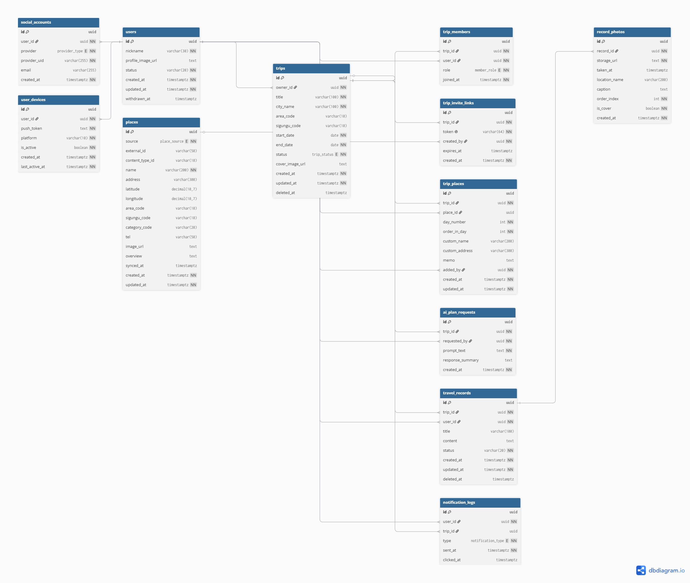

# 26s-w2-c1-03

## 공통과제 II : 협업형 실전 산출물 제작 (2인 1팀)

**목적:** 실시간 인터랙션, LLM Wrapper, Cross-Platform 중 하나의 옵션을 선택해 구현하며, 선택한 기술을 실제로 동작하는 형태의 산출물로 완성한다.

**선택 옵션:**

| 옵션 | 설명 |
|---|---|
| 실시간 인터랙션 | 사용자 간 상태 변화, 실시간 데이터 흐름, 스트리밍 응답 등 실시간성이 드러나는 기능을 구현 |
| LLM Wrapper | LLM API를 활용하여 AI 기능이 포함된 산출물을 구현 |
| Cross-Platform | 하나의 산출물을 여러 실행 환경에서 사용할 수 있도록 구현* |

> *데스크톱 앱 ↔ 모바일 앱; 혹은 다른 폼팩터에서의 앱; 웹만/웹 기반 프레임워크(Electron, Tauri 등) 대신 다른 프레임워크를 시도해보는 것을 적극 권장

**결과물:** 선택한 옵션이 적용된 작동 가능한 산출물, 실행 가능한 코드, 시연 자료 및 관련 문서

---

## 팀원

| 이름 | 학교 | GitHub | 역할 |
|---|---|---|---|
| 이예원 | 숙명여대 | [ywlee1127](https://github.com/ywlee1127) | FullStack Dev |
| 이지민 | KAIST | [ljm030206](https://github.com/ljm030206) | BackEnd Dev |

---

## 선택 옵션

- [ ] 실시간 인터랙션
- [x] LLM Wrapper
- [x] Cross-Platform

---

## 기획안

- **산출물 주제:** trip and end — AI 기반 여행 계획 및 기록 앱
- **제작 목적:** 여행 전 계획 수립의 시간/노력 부담과, 여행 후 사진 정리·기록의 번거로움을 AI로 줄여 여행 시작과 끝 모두에서 사용자 만족도를 높인다.
- **선택 옵션:** LLM Wrapper (OpenAI API 기반 여행 계획 생성·수정, 사진 선별) + Cross-Platform (Flutter 기반 단일 코드베이스로 iOS/Android 대응)
- **핵심 구현 요소:**
  - AI 기반 여행 계획 초안 생성 및 프롬프트 기반 수정 (OpenAI API 연동)
  - 온디바이스 1차 필터링 → 일자별 배치 전송 → AI 베스트샷(최대 15장) 선별 파이프라인
  - 카카오/애플/구글 소셜 로그인 전용 인증 시스템
- **사용 / 시연 시나리오:** 사용자가 도시와 날짜를 입력하면 AI가 관광지·맛집을 포함한 최적 동선의 여행 계획 초안을 생성한다. 사용자는 초안을 직접 수정하거나 추가 프롬프트로 AI에게 재요청해 계획을 완성한다. 여행이 끝나면 앱이 촬영 기간 내 사진을 온디바이스에서 1차 필터링하고, AI가 일자별 배치로 베스트샷 최대 15장을 추천한다. 사용자는 그중 최종 사용할 사진을 선택해 글과 함께 여행 기록을 작성하고, 이후 기록 목록에서 조회·수정·삭제할 수 있다.
- **팀원별 역할:**
  - 이예원 (FullStack Dev): Flutter 앱 UI/UX 전반(로그인, 계획 생성/편집, 사진 선별, 기록 작성/관리 화면), 백엔드 API 연동, 온디바이스 필터링(흔들림/노출/중복 제거, OCR, 얼굴 감지, EXIF 추출) 구현
  - 이지민 (BackEnd Dev): 백엔드 서버(API/DB 설계), 소셜 로그인 서버 측 토큰 검증, OpenAI API 연동(계획 생성·사진 선별 배치 처리), 임시 버퍼·암호화 스토리지 등 개인정보 처리 파이프라인 구현

### 개발 일정

| 날짜 | 목표 |
|---|---|
| Day 1 | 주제 정하기 |
| Day 2 | 기능 구체화 (기능명세서 작성, 기술 스택 확정), DB 스키마 설계 |
| Day 3 | 프로젝트 초기 세팅 (Flutter/백엔드 구조 잡기, 소셜 로그인 연동 착수) |
| Day 4 | 소셜 로그인 완료, AI 여행 계획 생성 기능(OpenAI 연동) 개발 |
| Day 5 | 여행 계획 수정/공동 편집 기능, AI 사진 선별 파이프라인(온디바이스 필터링~배치 전송) 개발 |
| Day 6 | 사진 선별 결과 UI, 여행 기록 작성/관리 기능 개발 및 전체 통합 테스트 |
| Day 7 | 버그 수정, UI 폴리싱, 시연 자료·발표 준비 |

---

## 구현 명세서

| 구현 요소 | 설명 | 우선순위 |
|---|---|---|
| 소셜 로그인 (카카오/애플/구글) | 이메일/비밀번호 없이 소셜 계정으로만 로그인, 최초 로그인 시 회원 자동 생성/연결 | 필수 |
| AI 기반 여행 계획 생성 및 수정 | 도시·날짜 입력 → AI가 동선 최적화된 계획 초안 생성, 장소 추가/제거/순서 변경 및 프롬프트 재수정 | 필수 |
| AI 기반 여행 사진 선별 및 기록 | 온디바이스 1차 필터링(흔들림/중복/OCR/얼굴 감지) → 최대 100장 임시 버퍼 → OpenAI 배치 선별(최대 15장) → 사용자 최종 선택 → 암호화 스토리지 저장 | 필수 |
| 사용자 여행 기록 관리 | 작성한 여행 기록 목록 조회, 요약 표시, 수정/삭제(연결 사진 함께 삭제) | 필수 |
| 공동 여행 계획 수립 | 공유 링크로 친구 초대, 동시 편집 시 데이터 충돌 없는 동기화 | 선택 |
| 로그인 실패/취소 및 로그아웃 처리 | 상황별 오류 안내·재시도, 로그아웃 시 세션 삭제 및 보호 화면 접근 제어 | 선택 |

---

## 아키텍처

<!-- 실시간 인터랙션: WebSocket/SSE/WebRTC 구조도 / LLM Wrapper: API 연동 흐름도 / Cross-Platform: 플랫폼 구성도 -->

---

## 설계 문서

> 프로젝트 성격에 따라 필요한 항목만 작성

### 화면 / 인터페이스 설계

<!-- Figma 링크, 화면 이미지, CLI 사용 예시, 앱 화면 등 -->

### 데이터 구조

<!-- DB 스키마, JSON 구조, 파일 저장 방식 등 -->


### API / 외부 서비스 연동

| Method / 방식 | Endpoint / 서비스 | 설명 | 요청 | 응답 | 비고 |
|---|---|---|---|---|---|
|  |  |  |  |  |  |

---

## 산출물 및 실행 방법

- **산출물 설명:**
- **실행 환경:**
- **실행 방법:**
- **시연 영상 / 이미지:** (선택)

### 실행 방법

```bash
# 환경 설정
cp .env.example .env

# 의존성 설치
npm install   # 또는 pip install -r requirements.txt 등

# 실행
npm run dev   # 또는 python main.py 등
```

### 기술 구성

| 분류 | 사용 기술 |
|---|---|
| 핵심 기술 |  |
| 실행 환경 |  |
| 데이터 저장 |  |
| 외부 API / 서비스 |  |
| 기타 |  |

---

## 회고 문서

> [KPT 방법론 참고](https://velog.io/@habwa/%EB%8B%A8%EA%B8%B0-%ED%94%84%EB%A1%9C%EC%A0%9D%ED%8A%B8-%ED%9A%8C%EA%B3%A0-KPT-%EB%B0%A9%EB%B2%95%EB%A1%A0)

### Keep — 잘 된 점, 다음에도 유지할 것

-
-
-

### Problem — 아쉬웠던 점, 개선이 필요한 것

-
-
-

### Try — 다음번에 시도해볼 것

-
-
-

### 팀원별 소감

**주성민:**

> 

**김희서:**

> 

---

## 참고 자료

### 실시간 인터랙션

**WebSocket**
- https://developer.mozilla.org/en-US/docs/Web/API/WebSockets_API
- https://techblog.woowahan.com/5268/
- https://tech.kakao.com/posts/391
- https://daleseo.com/websocket/
- https://kakaoentertainment-tech.tistory.com/110

**Socket.IO**
- https://socket.io/docs/v4/
- https://inpa.tistory.com/entry/SOCKET-%F0%9F%93%9A-Namespace-Room-%EA%B8%B0%EB%8A%A5
- https://adjh54.tistory.com/549
- https://fred16157.github.io/node.js/nodejs-socketio-communication-room-and-namespace/

**SSE (Server-Sent Events)**
- https://developer.mozilla.org/en-US/docs/Web/API/Server-sent_events
- https://developer.mozilla.org/ko/docs/Web/API/Server-sent_events/Using_server-sent_events
- https://api7.ai/ko/blog/what-is-sse

**TCP / UDP Socket**
- https://docs.python.org/3/library/socket.html
- https://inpa.tistory.com/entry/NW-%F0%9F%8C%90-%EC%95%84%EC%A7%81%EB%8F%84-%EB%AA%A8%ED%98%B8%ED%95%9C-TCP-UDP-%EA%B0%9C%EB%85%90-%E2%9D%93-%EC%89%BD%EA%B2%8C-%EC%9D%B4%ED%95%B4%ED%95%98%EC%9E%90

**gRPC Streaming**
- https://grpc.io/docs/what-is-grpc/core-concepts/
- https://tech.ktcloud.com/entry/gRPC%EC%9D%98-%EB%82%B4%EB%B6%80-%EA%B5%AC%EC%A1%B0-%ED%8C%8C%ED%97%A4%EC%B9%98%EA%B8%B0-HTTP2-Protobuf-%EA%B7%B8%EB%A6%AC%EA%B3%A0-%EC%8A%A4%ED%8A%B8%EB%A6%AC%EB%B0%8D
- https://tech.ktcloud.com/entry/gRPC%EC%9D%98-%EB%82%B4%EB%B6%80-%EA%B5%AC%EC%A1%B0-%ED%8C%8C%ED%97%A4%EC%B9%98%EA%B8%B02-Channel-Stub
- https://inspirit941.tistory.com/371
- https://devocean.sk.com/blog/techBoardDetail.do?ID=167433

**WebRTC**
- https://developer.mozilla.org/en-US/docs/Web/API/WebRTC_API
- https://webrtc.org/getting-started/overview
- https://web.dev/articles/webrtc-basics?hl=ko
- https://devocean.sk.com/blog/techBoardDetail.do?ID=164885
- https://beomkey-nkb.github.io/%EA%B0%9C%EB%85%90%EC%A0%95%EB%A6%AC/webRTC%EC%A0%95%EB%A6%AC/
- https://gh402.tistory.com/45
- https://on.com2us.com/tech/webrtc-coturn-turn-stun-server-setup-guide/

**QUIC / WebTransport**
- https://developer.mozilla.org/en-US/docs/Web/API/WebTransport_API
- https://datatracker.ietf.org/doc/html/rfc9000
- https://news.hada.io/topic?id=13888

#### KCLOUD VM / Cloudflare Tunnel 환경별 주의사항

| 환경 | 사용 가능(권장) 기술 | 포트/조건 | 주의할 기술 |
|---|---|---|---|
| **로컬 / 일반 VM** | HTTP/REST, WebSocket, Socket.IO, SSE, TCP Socket, gRPC Streaming, WebRTC, QUIC/WebTransport 등 대부분 가능 | 직접 포트 개방 가능. 예: 3000, 5000, 8000, 8080, 9000 등. 외부 공개 시 방화벽/보안그룹/공인 IP 설정 필요 | WebRTC는 STUN/TURN 필요 가능. QUIC/WebTransport는 HTTP/3 · UDP 지원 필요 |
| **KCLOUD VM (VPN 내부)** | HTTP/REST, WebSocket, Socket.IO, SSE, WebRTC 시그널링 | 접속 기기 VPN 필요. 기본 허용 포트: **22, 80, 443**. 개발 포트(3000, 8000, 8080 등)는 직접 접근 제한 가능 | TCP Socket은 포트 제한 있음. gRPC는 HTTP/2 설정 필요. WebRTC 미디어·UDP·QUIC/WebTransport 비권장 |
| **KCLOUD VM + Tunnel** | HTTP/REST, WebSocket, Socket.IO, SSE, WebRTC 시그널링 | VM의 `localhost:<port>`를 도메인에 연결. `localPort`는 **1024~65535**. 예: 3000, 8000, 8080 가능 | 순수 TCP Socket, UDP, WebRTC 미디어/DataChannel, QUIC/WebTransport 불가. gRPC 보장 어려움 |
| **외부 서비스 + 우리 도메인** | HTTP/REST, WebSocket, Socket.IO, SSE, WebRTC 시그널링 | Vercel/Netlify/Railway/Render/AWS/GCP 등에 배포 후 CNAME/A 레코드 연결. 보통 외부는 **443** 사용 | WebSocket/gRPC/TCP/UDP는 플랫폼 지원 여부 확인 필요. 서버리스 플랫폼은 장시간 연결 제한 가능 |
| **서버 없이 외부 SaaS 사용** | Supabase Realtime, Firebase, Pusher/Ably, LLM API Streaming | 직접 포트 관리 불필요. 각 서비스 SDK/API 사용 | 커스텀 TCP/UDP 서버 구현 불가. WebRTC는 STUN/TURN 필요할 수 있음 |

### LLM Wrapper

- https://github.com/teddylee777/openai-api-kr
- https://github.com/teddylee777/langchain-kr
- https://devocean.sk.com/blog/techBoardDetail.do?ID=167407
- https://mastra.ai/docs

### Cross-Platform

- https://flutter.dev/
- https://reactnative.dev/
- https://docs.expo.dev/
- https://kotlinlang.org/multiplatform/
