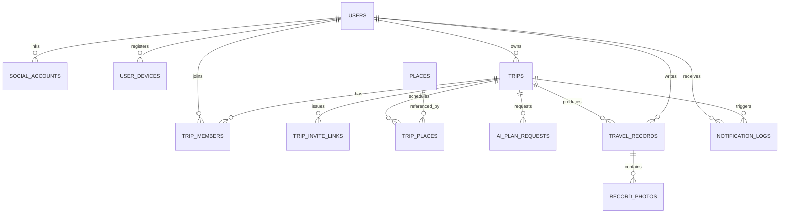

# trip and end — 백엔드/앱 개발 계획 (DEVELOPMENT_PLAN)

> 본 문서는 구현 착수 전 설계 문서입니다. 코드, Entity, Controller, Repository는 아직 작성되지 않았으며, 이 계획이 팀 내 확인된 이후 Phase 순서대로 구현을 시작합니다.

| 항목 | 내용 |
|---|---|
| 문서 작성일 | 2026-07-10 |
| 대상 프로젝트 | trip and end (AI 기반 여행 계획 및 기록 앱, KAIST 몰입캠프 공통과제 II) |
| 앱/백엔드 스택 | Flutter(Riverpod), NestJS(TypeORM), PostgreSQL(Supabase), Firebase Storage, JWT(Passport), OpenAI API, TourAPI, Google Places API (New) |
| 팀 | 이예원(FullStack, Flutter 중심) / 이지민(BackEnd, NestJS 중심) |
| 참고 문서 | `README.md`, `AI_기반_여행_계획_및_기록_앱_기능명세서_2026-07-10_v2.md`, `trip_and_end_erd.dbml`, `API_명세서_2026-07-10_v1.md` |

---

## 1. 프로젝트 분석

### 1.1 프로젝트 목적

여행 전 계획 수립의 시간/노력 부담과, 여행 후 사진 정리·기록의 번거로움을 AI로 줄여 여행의 시작과 끝 모두에서 사용자 만족도를 높이는 것이 목적입니다. 단순 정보 제공이 아니라, **AI가 초안을 만들고 사용자가 다듬는 협업형 계획 수립**과 **AI가 후보를 추리고 사용자가 최종 선택하는 사진 기록**이라는 두 개의 "AI 초안 + 사람의 최종 확정" 구조가 제품 전체를 관통합니다.

### 1.2 핵심 기능 요약

기능명세서 기준으로 백엔드가 지원해야 할 핵심 기능은 다음과 같습니다.

1. **사용자 인증(소셜 로그인 전용)** — 카카오/애플/구글로만 가입·로그인, 이메일/비밀번호 미제공
2. **AI 기반 여행 계획 생성 및 수정** — 도시·날짜 입력 → 후보 장소 추천 → 사용자 선택 → AI 동선 생성 → 수동 편집/AI 챗봇 재수정
3. **공동 여행 계획 수립** — 공유 링크로 친구 초대, 동시 편집 시 데이터 충돌 없는 동기화(선택 기능)
4. **AI 기반 여행 사진 선별 및 기록** — 온디바이스 1차 필터 → 서버 임시 버퍼 → OpenAI 배치 선별(최대 15장) → 사용자 최종 선택 → 암호화 스토리지 영구 저장
5. **사용자 여행 기록 관리** — 기록 목록/상세/수정/삭제, 삭제 시 연결 사진 완전 삭제

### 1.3 주요 도메인

ERD(`trip_and_end_erd.dbml`)와 API 명세서를 대조한 결과, 아래 8개 도메인(NestJS 모듈)으로 구분됩니다.

| 도메인(모듈) | 책임 | 관련 테이블 |
|---|---|---|
| `auth` | 소셜 로그인 검증, JWT 발급/재발급/폐기 | (Entity 없음, `users`/`social_accounts` 재사용) |
| `users` | 프로필, 디바이스 푸시 토큰, 회원 탈퇴 | `users`, `social_accounts`, `user_devices` |
| `trips` | 여행 생성/조회/수정/삭제, 멤버·초대링크 | `trips`, `trip_members`, `trip_invite_links` |
| `places` | TourAPI/Kakao 장소 캐싱, 후보 추천 | `places` |
| `schedule` | 일자별 장소 배치, AI 계획 생성/재수정 | `trip_places`, `ai_plan_requests` |
| `collaboration` | 공동 편집 실시간 동기화(WebSocket) | 자체 Entity 없음 → `trip_members`/`trip_places` 재사용 |
| `records` | 여행 기록(일기+사진) 작성/관리, 사진 파이프라인 | `travel_records`, `record_photos` |
| `notifications` | 여행 종료 감지, 기록 유도 푸시 | `notification_logs` |

`common`, `config`는 도메인이 아니라 횡단 관심사(공통 응답/에러 포맷, 전역 예외 처리, 환경설정, 외부 API 클라이언트 설정)를 담당합니다. `storage`는 자체 Entity 없이 Firebase Storage 업로드만 담당하는 유틸리티 모듈로, `records` 도메인(Phase 11)에서 처음 필요해집니다.

### 1.4 전체 시스템 흐름

```
[소셜 로그인(카카오/애플/구글) — 최초 로그인 시 신규 회원 자동 생성]
        │
        ▼
1) 프로필 최소 정보 입력(닉네임) — users 도메인
        │
        ▼
2) 여행 생성(도시·날짜) — trips 도메인, trip_members에 owner 자동 등록
        │
        ▼
3) 관광지 후보 추천(TourAPI+Kakao 병합 인기순) — places 도메인
        │
        ▼
4) 후보 선택 → AI 동선 생성(OpenAI, 동기) — schedule 도메인, trip_places bulk insert
        │
        ├─ (선택) 공유 링크로 친구 초대 → 공동 편집 — trips.invite-links + collaboration(WS)
        │
        ▼
5) 수동 편집 / AI 챗봇 재수정 — schedule 도메인, ai_plan_requests 이력 기록
        │
        ▼
6) [여행 진행 기간 — 서비스 외부 활동]
        │
        ▼
7) 여행 종료일 다음날 배치가 trips.status=completed 전환 + 기록 유도 푸시 — notifications 도메인
        │
        ▼
8) 사용자가 알림 클릭/"기록 시작" 선택 → 온디바이스 1차 필터 → metadata 등록 → 실물 업로드(임시 버퍼)
        │
        ▼
9) curate(OpenAI 일자별 배치, 최종 최대 15장) → candidates 미리보기 → finalize(선택분만 영구 저장) — records 도메인
        │
        ▼
10) 여행 기록(일기) 작성 → 기록 목록/상세 조회, 수정, 삭제 — records 도메인
```

이 흐름에서 `users`는 모든 도메인의 기반이 되고, `trips`는 `places`/`schedule`/`collaboration`/`records`의 기반이 됩니다. `records`는 `trips.status=completed` 이후에만 의미가 있으므로 `notifications`(여행 종료 감지)에 의존하며, `notifications`는 반대로 `trips`의 상태 변화를 감지하는 파생 도메인입니다. 이 의존 방향이 이후 Phase 순서(§5)와 API 구현 순서(§6)의 근거가 됩니다.

---

## 2. 스택 확정에 따른 구체화 항목

| 항목 | 결정 |
|---|---|
| 백엔드 프레임워크 | NestJS (모듈: `auth`, `users`, `trips`, `places`, `schedule`, `collaboration`(WS), `records`, `notifications`, `storage`, `common`, `config`) |
| DB | Supabase Postgres — `trip_and_end_erd.dbml`을 그대로 마이그레이션 |
| ORM | TypeORM (NestJS 공식 통합, 팀 확정 필요 시 Prisma로 대체 가능) |
| 인증 | Supabase Auth는 사용하지 않고 **자체 JWT 발급**(NestJS Passport-JWT). 소셜 로그인 검증은 백엔드가 직접 처리 (API 명세서 §1) |
| Storage | Firebase Storage — `record-photos/` 경로(영구, 최종 선택 사진만), `profile-images/` 경로(프로필 사진, FE 직접 업로드) / 임시 버퍼는 **로컬 서버 디스크**(API 명세서 §6과 동일) |
| 실시간 통신 | NestJS `@nestjs/websockets` + Socket.IO adapter |
| 외부 API | OpenAI(`openai` SDK), TourAPI(REST, 국내 전용), Google Places API (New)(평점/리뷰수 — Kakao 로컬 API는 이 데이터를 제공하지 않아 대체, §16 참고) |

---

## 3. 백엔드 아키텍처

### 3.1 계층 구조

Layered Architecture를 도메인별로 적용합니다.

```
Controller  →  요청/응답 매핑, class-validator 검증, DTO 변환만 담당 (비즈니스 로직 없음)
    ↓
Service     →  트랜잭션 경계, 비즈니스 로직, 도메인 간 조합
    ↓
Repository  →  TypeORM Repository, 영속성 접근만 담당
    ↓
Entity      →  DB 테이블 매핑, 도메인 불변조건(invariant) 캡슐화
```

- **DTO 경계**: Entity는 어떤 계층에서도 Controller 밖으로 직접 반환하지 않습니다. Request DTO → Service에서 Entity로 변환, Entity → Response DTO로 변환 후 반환.
- **의존 방향**: Controller → Service → Repository 단방향. Service는 다른 도메인의 Service를 호출해 조합하며(예: `records` 서비스가 `trips` 서비스를 호출해 소속 확인), 다른 도메인의 Repository를 직접 건드리지 않습니다.
- **예외 흐름**: 각 도메인의 커스텀 예외(`TripNotFoundException` 등)는 `common/filters`의 `GlobalExceptionFilter`가 일괄 처리하여 표준 에러 응답(§12)으로 변환합니다.

### 3.2 모듈(디렉터리) 구조

```
src
├── main.ts
├── app.module.ts
│
├── auth/                       # 로그인/JWT — Entity 없음(users/social_accounts 재사용)
│   ├── auth.controller.ts
│   ├── auth.service.ts
│   ├── strategies/             # JwtStrategy, 소셜 provider 검증기(Kakao/Apple/Google)
│   ├── guards/                 # JwtAuthGuard
│   └── dto/
│
├── users/                      # 프로필 + 디바이스 푸시 토큰
│   ├── users.controller.ts
│   ├── users.service.ts
│   ├── entities/                # User, SocialAccount, UserDevice
│   └── dto/
│
├── trips/                       # 여행 생성/멤버/초대링크
│   ├── trips.controller.ts
│   ├── trips.service.ts
│   ├── entities/                # Trip, TripMember, TripInviteLink
│   └── dto/
│
├── places/                       # TourAPI/Kakao 장소 캐시 + 후보 추천
│   ├── places.controller.ts
│   ├── places.service.ts
│   ├── entities/                # Place
│   └── clients/                  # TourApiClient, KakaoLocalClient
│
├── schedule/                      # 일자별 배치 + AI 계획 생성/재수정
│   ├── schedule.controller.ts
│   ├── schedule.service.ts
│   ├── entities/                  # TripPlace, AiPlanRequest
│   └── client/                    # OpenAiScheduleClient
│
├── collaboration/                  # 공동 편집 실시간 동기화(자체 Entity 없음)
│   ├── collaboration.gateway.ts    # WebSocket Gateway
│   └── conflict-resolution.service.ts
│
├── records/                        # 여행 기록 + 사진 파이프라인
│   ├── records.controller.ts
│   ├── records.service.ts
│   ├── entities/                    # TravelRecord, RecordPhoto
│   ├── pipeline/                    # PhotoBufferService, PhotoCurationService
│   └── dto/
│
├── notifications/                    # 여행 종료 감지 + 푸시
│   ├── notifications.service.ts
│   ├── notification.scheduler.ts     # trip 종료 배치(cron)
│   └── entities/                      # NotificationLog
│
├── storage/                            # Firebase Storage 업로드 유틸(자체 Entity 없음)
│   └── supabase-storage.client.ts
│
├── common/                              # 횡단 관심사
│   ├── filters/                          # GlobalExceptionFilter
│   ├── exceptions/                        # BusinessException, ErrorCode
│   ├── pipes/                              # 전역 ValidationPipe 설정
│   └── decorators/                          # @CurrentUser() 등
│
└── config/
    ├── database.config.ts
    ├── jwt.config.ts
    ├── openai.config.ts
    ├── tourapi.config.ts
    ├── kakao.config.ts
    └── supabase-storage.config.ts
```

`collaboration`이 자체 Entity 없이 `trip_members`/`trip_places`를 재사용하는 것은 의도된 설계입니다. 실시간 동기화는 별도 데이터를 저장하지 않고 기존 스케줄 데이터의 변경을 브로드캐스트할 뿐이므로, 새 테이블을 만들지 않고 `schedule` 도메인의 Repository/Service를 그대로 재사용해 DRY 원칙을 지킵니다.

### 3.3 데이터 흐름 예시 (요청 → 응답)

AI 스케줄 생성 API를 예로 계층 간 데이터 흐름을 설명합니다.

```
POST /trips/{tripId}/schedule/generate
  → ScheduleController: JwtAuthGuard로 인증, @Valid ScheduleGenerateDto 검증(selectedPlaceIds 배열)
  → ScheduleService.generate()
      1. TripsService.assertMember(tripId, userId) 호출 → trip_members 소속 검증(다른 도메인 Service 호출로 조합)
      2. PlacesService.findByIds(selectedPlaceIds) → 선택된 장소 상세 정보 조회
      3. OpenAiScheduleClient.requestSchedule(placesDetail, tripDuration) 호출 → 일자별 동선 응답 수신
      4. TripPlace bulk insert(day_number/order_in_day 배정, added_by=요청자)
      5. CollaborationGateway.broadcast(tripId, 'schedule:generated', schedule) — 다른 협업 멤버 화면 갱신
  → ScheduleResponseDto로 변환 후 반환
```

이처럼 하나의 API 호출이 여러 도메인 서비스를 조합하지만, 각 도메인은 자신의 Repository만 사용하고 다른 도메인의 Repository에 직접 접근하지 않습니다(도메인 간 결합은 Service 인터페이스 수준에서만 발생).

---

## 4. 도메인 설계 (ERD 기반)

ERD(`trip_and_end_erd.dbml`) 기준으로 12개 테이블을 도메인별로 정리합니다.

### 4.1 User 도메인

**User** (`users`) — 닉네임, 프로필 이미지 URL(Firebase Storage에 FE가 직접 업로드 후 URL만 저장), 상태(`active`/`withdrawn`, soft delete)

**SocialAccount** (`social_accounts`) — `(provider, provider_uid)` unique. 한 사용자가 여러 소셜 계정을 연결할 수 있는 구조로 확장 대비.

**UserDevice** (`user_devices`) — 푸시 토큰, 플랫폼(ios/android), 활성 여부. 알림 발송 대상 조회에 사용.

관계: `User 1 --- N SocialAccount`, `User 1 --- N UserDevice`

### 4.2 Trip 도메인

**Trip** (`trips`) — 제목, 대표 도시명, TourAPI 지역/시군구 코드, 시작/종료일, 상태(`planning`/`ongoing`/`completed`), 대표사진 URL(`cover_image_url`), soft delete

**TripMember** (`trip_members`) — `(trip_id, user_id)` unique, 역할(`owner`/`editor`/`viewer`). 여행 생성 시 생성자가 `owner`로 자동 등록됨.

**TripInviteLink** (`trip_invite_links`) — 공유 링크 토큰, 만료 시각. 링크로 참여 시 기본 `role=editor`로 `trip_members`에 등록.

관계: `User 1 --- N Trip`(owner), `Trip 1 --- N TripMember N --- 1 User`(N:M), `Trip 1 --- N TripInviteLink`

### 4.3 Place 도메인

**Place** (`places`) — TourAPI/Kakao 응답을 캐싱하는 마스터 테이블. `(source, external_id)` unique로 외부 API 재호출을 최소화하며, `(area_code, sigungu_code)`/`(latitude, longitude)` 인덱스로 후보 조회를 지원. 사용자가 직접 추가한 장소는 `source=custom`.

### 4.4 Schedule / AI Plan 도메인

**TripPlace** (`trip_places`) — 여행의 일자별(`day_number`) 장소 목록과 순서(`order_in_day`). `place_id`가 없으면 `custom_name`/`custom_address`로 사용자 직접 입력 장소를 표현.

**AiPlanRequest** (`ai_plan_requests`) — AI 계획 생성/수정 요청 이력(`prompt_text`, `response_summary`). 추후 개인화 추천 모델 학습 데이터로 활용 가능.

관계: `Trip 1 --- N TripPlace`, `Place 1 --- N TripPlace`(nullable), `Trip 1 --- N AiPlanRequest`

### 4.5 Collaboration 도메인

자체 테이블은 없습니다. `trip_invite_links`(§4.2)로 초대를, WebSocket Gateway가 `trip_places`(§4.4)의 변경을 실시간으로 브로드캐스트합니다. 충돌 처리는 `trip_places.updated_at` 기반 낙관적 잠금으로 처리합니다(§10).

### 4.6 Record / Photo 도메인

**TravelRecord** (`travel_records`) — `(trip_id, user_id)` unique(한 여행당 사용자 1인 1기록). `status`(`draft`/`published`), 작성자 본인만 조회 가능(비공개 원칙).

**RecordPhoto** (`record_photos`) — **최종 선택된 사진만** 저장(`storage_url`). EXIF에서 추출한 촬영일시/지명(원본 GPS 좌표는 미저장), 캡션, 순서, 대표사진 여부(`is_cover`). AI가 추천했으나 미선택된 사진은 이 테이블에 없음(pass-through 처리, §11).

관계: `Trip 1 --- N TravelRecord N --- 1 User`, `TravelRecord 1 --- N RecordPhoto`

### 4.7 Notification 도메인

**NotificationLog** (`notification_logs`) — 여행 종료 알림(`trip_end_reminder`), 초대 알림(`trip_invite`) 발송 이력과 클릭 시각(`clicked_at`, 사용자가 알림을 클릭해 기록 작성을 시작한 시각).

### 4.8 ERD 요약



---

## 5. 개발 Phase

의존 관계(§1.4, §4)에 따라 총 14개 Phase로 나눕니다. 각 Phase는 이전 Phase가 완료되어야 시작할 수 있습니다. FE(이예원)/BE(이지민) 작업은 각 Phase 안에 함께 표기하며, FE가 BE 완료를 기다려야 하는 항목은 **"⛓ 의존"**으로 표시합니다.

> **[2026-07-12 갱신]** Phase 1~7을 실제 코드와 대조 감사(백엔드 `npm test`/`tsc --noEmit`, 프론트 `flutter analyze` + 전 소스 리딩)한 결과를 반영해 각 Phase를 체크리스트로 재작성했습니다. `[x]`는 코드로 확인된 완료 항목, `[ ]`는 아직 안 됐거나 계획과 실제 구현이 어긋나 있어 **정리가 필요한 항목**입니다. 이 갱신은 문서만 손보는 작업이며 코드는 건드리지 않았습니다 — 아래 `[ ]` 항목은 실제 수정 작업의 To-do 목록으로 사용하세요.

### Phase 1 — 프로젝트 초기 설정 ✅ 완료
- **목표**: 실행 가능한 최소 골격 구축, Supabase 프로젝트 연결 확보
- **체크리스트**:
  - [x] BE: NestJS 프로젝트 초기화, 모듈 스캐폴딩(§3.2 전체 디렉터리)
  - [x] BE: Supabase 프로젝트 생성(Postgres+Storage)
  - [x] FE: Flutter 프로젝트 초기화, feature-first 폴더 구조(`lib/features/*`)
  - [x] FE: 상태관리 Riverpod 채택 및 전역 적용
  - [x] 공통: `.env`/`.env.example` 분리, `.env`는 `.gitignore`에 포함되어 있고 실제로 커밋된 적 없음(과거 0바이트 커밋 1건 확인, 노출 아님)
  - [x] **[문서 불일치 — 해결됨]** `#CBFCE7`로 잘못 적혀 있던 메인 컬러 표기를 점검한 결과 이 문서 본문(§1, §5 Phase1, §14)에는 더 이상 `#CBFCE7`이 남아있지 않고 이미 `#FAFCBD`(브랜드 라임, `frontend/design.md`/`app_colors.dart` 기준)로 일치함. 앞으로 디자인 세부사항은 항상 `frontend/design.md`를 최종 기준으로 삼는다.
- **완료 조건**: `npm run start:dev`와 `flutter run`이 각각 정상 기동, Supabase 대시보드에서 연결 정보 확보 — 충족
- **선행 Phase**: 없음
- **산출물**: NestJS/Flutter 초기 커밋, `.env.example`

### Phase 2 — 공통 기반(Common/Config) 구축 ✅ 완료
- **목표**: 모든 도메인이 공유할 표준을 이후 Phase보다 먼저 확정해 반복 작업 제거
- **체크리스트**:
  - [x] BE: 공통 응답/에러 포맷(API 명세서 §0 기준 — 성공은 raw JSON, 실패는 `{ error: { code, message } }`) — `common/filters/global-exception.filter.ts`
  - [x] BE: `common/exceptions/BusinessException` + `ErrorCode`
  - [x] BE: 전역 `ValidationPipe`(class-validator, whitelist/forbidNonWhitelisted/transform)
  - [x] BE: `ConfigModule` + env 스키마 검증(Joi, `config/env.validation.ts`)
  - [x] **[설정 불일치 — 해결됨]** `src/main.ts`가 이제 `CORS_ORIGIN`을 실제로 읽어 적용함 — 미설정 시 기존과 동일하게 전체 origin 허용(로컬 개발 편의), 값이 있으면(쉼표로 여러 origin 구분 가능) 그 origin으로 제한. `src/config/env.validation.ts`에도 `CORS_ORIGIN`(optional)을 추가해 스키마 문서화. 배포 전 실제 프론트 origin으로 `CORS_ORIGIN`을 채우는 것은 여전히 배포 담당자가 해야 할 일(§16).
- **완료 조건**: 임시 테스트 컨트롤러에서 예외 발생 시 표준 에러 포맷으로 응답됨을 확인 — 충족
- **선행 Phase**: Phase 1
- **산출물**: `common/`, `config/` 모듈 일체

### Phase 3 — DB 스키마 및 Entity 생성 (전 도메인) ✅ 완료
- **목표**: ERD 12개 테이블을 한 번에 Supabase에 생성하고 TypeORM Entity로 매핑
- **체크리스트**:
  - [x] BE: `trip_and_end_erd.dbml` 기준 마이그레이션(`src/database/migrations/*-InitialSchema.ts`) — §7 순서와 다르게 "전 테이블 생성 후 FK 일괄 추가" 방식으로 구현했으나 결과적으로 순서 제약을 우회하며 동일한 목적 달성(문제 아님)
  - [x] BE: 전 도메인 Entity 12종 작성 완료(User, SocialAccount, UserDevice, Trip, TripMember, TripInviteLink, Place, TripPlace, AiPlanRequest, TravelRecord, RecordPhoto, NotificationLog)
  - [x] unique 인덱스 확인됨: `(provider, provider_uid)`, `(trip_id, user_id)`(trip_members), `(source, external_id)`(places), `(trip_id, user_id)`(travel_records)
  - [x] Phase 4 JWT rotation을 위한 `refresh_tokens` 테이블 추가(원 ERD엔 없던 항목, 의도된 확장 — ERD 문서(`trip_and_end_erd.dbml`) 쪽에도 반영해둘 것)
  - [x] **[검증 완료]** 로컬 Docker Postgres(`postgres:16-alpine`, 일회성 컨테이너, 실 Supabase 아님)를 띄워 `TEST_DATABASE_URL`로 `npm run test:db` 실행 — `initial-schema.integration-spec.ts`/`trips.service.integration-spec.ts` 2개 스위트, 11개 테스트 전부 통과(마이그레이션이 라이브 Postgres에서 깨끗이 돌고 CRUD/cascade/unique 제약도 정상 동작함을 확인). 컨테이너는 확인 후 정리(rm)함 — 상시 유지되는 인프라 아님.
- **완료 조건**: 마이그레이션 실행 후 12개 테이블 전부 생성 확인, Repository 단위 테스트로 기본 CRUD 동작 확인 — 충족
- **선행 Phase**: Phase 2
- **산출물**: 전 도메인 `entities/`, 마이그레이션 스크립트

### Phase 4 — 인증(Auth): 소셜 로그인 & JWT ✅ 완료(카카오/구글 2개 제공자, 애플 드랍 확정)
- **목표**: 이후 모든 API가 전제하는 인증 계층 완성 (E2E 체크포인트)
- **[범위 확정, 2026-07-12] 애플 로그인은 이 프로젝트에서 지원하지 않습니다.** Apple Developer 유료 계정이 없어 Sign in with Apple 자체가 불가능합니다(심사/인증서 문제가 아니라 계정이 없어서 착수가 안 됨). 카카오/구글 2개 제공자만 지원하는 것으로 스코프를 확정하고, 아래 항목들을 정리해야 합니다.
  - [ ] 이 문서 §5 Phase4의 "3개 제공자" 표현을 "카카오/구글 2개 제공자"로 정정
  - [ ] §16(리스크 및 열린 질문)의 "애플 로그인 인증서/심사 이슈" 행을 리스크 목록에서 제거하고 "결정됨" 섹션으로 이동(사유: Apple Developer 계정 미보유)
  - [ ] `AI_기반_여행_계획_및_기록_앱_기능명세서_2026-07-10_v2.md` §5.3(애플 로그인 연동)·5.1 수용기준 2번("사용자는 애플 계정으로 로그인할 수 있어야 한다")을 "지원 안 함(Apple Developer 계정 미보유)"으로 갱신 — 기능명세서가 이 결정을 전혀 반영하지 못한 유일한 문서
  - [ ] `API_명세서_2026-07-10_v1.md` §1의 `POST /auth/{provider}/login` 설명에서 `provider: kakao|apple|google` 중 `apple`을 제거(코드는 이미 `kakao`/`google`만 허용 — `social-token-verifier.ts`의 `SUPPORTED_SOCIAL_PROVIDERS`)
  - 코드 자체(백엔드 `SUPPORTED_SOCIAL_PROVIDERS`, DB enum `provider_type`에 `apple` 값이 남아있는 것, 프론트 로그인 화면)는 이미 카카오/구글만 동작하도록 일관되게 되어 있어 **수정 불필요** — 문서만 못 따라간 상태였음
- **체크리스트**:
  - [x] BE ①: JWT 발급/검증 공통 모듈(Access 30분 / Refresh 30일, refresh는 DB에 **해시**로 저장, 재발급 시 rotation + 재사용 탐지 시 해당 유저 전체 세션 무효화) — `auth.service.ts`, 유닛테스트로 재사용 탐지 케이스까지 검증됨
  - [x] BE ②: 카카오/구글 각 제공자 토큰 검증 로직(`kakao-token-verifier.ts`, `google-token-verifier.ts`)
  - [x] BE ③: `POST /auth/{provider}/login`, `POST /auth/token/refresh`, `POST /auth/logout`
  - [x] BE: 실패 사유별 에러코드(`USER_CANCELLED`/`NETWORK_ERROR`/`TOKEN_INVALID`/`PROVIDER_ERROR`) 구현 및 실제 분기
  - [x] FE: 카카오/구글 로그인 SDK 연동(`kakao_login_service.dart`, `google_login_service.dart`), 로그인 화면, `flutter_secure_storage`, Dio 인터셉터(JWT 자동 첨부/401 재발급)
  - [ ] **[네이티브 콘솔 설정, 코드 아님]** iOS 실기기 로그인이 카카오 개발자 콘솔의 Bundle ID 미등록/불일치, Google Cloud 프로젝트 불일치(웹 클라이언트 ID가 Firebase 프로젝트와 다른 GCP 프로젝트 소속)로 현재 막혀 있음 — 별도로 콘솔 설정 확인 중, 완료되면 이 항목 체크
  - [x] **[해결됨]** `frontend/lib/core/network/api_client.dart`: refresh 후 재시도한 요청이 또 401을 받는 엣지케이스에서도 다른 실패 분기와 동일하게 `_tokenStorage.clear()`를 호출하도록 수정 — 무효 토큰을 붙잡고 매 요청마다 refresh만 반복하던 상태를 없애고 재로그인을 유도함
- **완료 조건**: **카카오/구글 2개 제공자** 모두 실기기에서 로그인 성공(원래 "3개 제공자"에서 정정), 미인증 요청 401, refresh rotation/재사용탐지 동작 확인 — 코드는 충족, 실기기 로그인은 콘솔 설정 완료 후 재확인 필요
- **선행 Phase**: Phase 3(User/SocialAccount Entity)
- **산출물**: `auth/` 모듈 전체, FE 로그인 플로우

### Phase 5 — User API ✅ 완료
- **목표**: 프로필/디바이스 관리, 최초 로그인 온보딩
- **체크리스트**:
  - [x] BE: `GET/PATCH/DELETE /users/me`
  - [x] BE: `POST/DELETE /users/me/devices`
  - [x] FE: 최초 로그인 시 닉네임 입력 화면(`onboarding_nickname_screen.dart`)
  - [x] FE: 프로필 조회/수정 화면(`profile_screen.dart`), 로그아웃, 회원 탈퇴 확인 다이얼로그
  - [x] FE: 프로필 이미지 **Firebase Storage 직접 업로드**(`profile_image_upload_service.dart`) 후 다운로드 URL만 `PATCH /users/me`로 전달 — §11.1 설계와 정확히 일치
  - [x] **[해결됨]** FE: 푸시 권한 요청 + 디바이스 토큰 등록 구현. `firebase_messaging` 추가, `features/notifications/push_notification_service.dart`(권한 요청 → FCM 토큰 발급 → `POST /users/me/devices`, 실패해도 로그인/시작 흐름을 막지 않도록 예외를 삼킴)를 로그인 성공 시(`login_controller.dart`)와 앱 시작 시 유효 세션 확인 후(`main.dart` `_StartupGate`) 둘 다에서 호출. 로그아웃 시(`AuthController.logout()`)에는 등록 때 저장해둔 device id로 `DELETE /users/me/devices/{deviceId}` 호출해 비활성화. Android는 `POST_NOTIFICATIONS` 런타임 권한을 매니페스트에 추가. iOS는 APNs 자체가 Apple Developer 유료 계정을 요구해(Phase 4에서 이미 확정된 제약) 실기기 수신 확인은 계정 확보 전까지 보류 — 코드/권한 요청 흐름은 준비됨.
  - [x] **[해결됨]** `frontend/lib/features/profile/data/users_api.dart` 상단 주석을 실제 구현(디바이스 등록/해제 포함)에 맞게 정리
  - [x] **[해결됨]** 회원 탈퇴(`DELETE /users/me`) 시 `UsersService.withdraw()`가 해당 유저의 미폐기 refresh token을 전부 revoke하도록 수정(`auth.service.ts`의 재사용 탐지 시 전체 세션 무효화와 동일 패턴 재사용) — 유닛테스트 추가
- **완료 조건**: 프로필 조회/수정/탈퇴, 디바이스 등록/해제 정상 동작. 프로필 이미지가 Storage에 저장되고 URL이 반영됨 — 충족
- **선행 Phase**: Phase 4
- **산출물**: `users/` 모듈

> 프로필 이미지는 백엔드가 파일을 직접 다루지 않고 URL 문자열만 저장합니다(§11.1). 반면 여행 기록 사진은 AI 선별·암호화·임시 폐기 요구사항 때문에 반드시 백엔드를 경유합니다(§11.2, Phase 11) — 같은 "이미지 저장"이라도 두 경로가 다른 이유입니다.

### Phase 6 — Trip 생성/관리 API ✅ 완료
- **목표**: 이후 모든 여행 관련 API가 전제하는 `tripId` 리소스 확보
- **체크리스트**:
  - [x] BE: `POST/GET/PATCH/DELETE /trips`
  - [x] BE: 생성 시 `trip_members`에 `owner` 자동 등록 — `trips.service.ts`의 `create()`가 트립 생성과 멤버 insert를 하나의 트랜잭션으로 묶음(코드로 직접 확인됨, 단순 추정 아님)
  - [x] BE: 삭제는 owner만, soft delete(`deletedAt`)
  - [x] FE: 여행 생성 화면(도시 검색 + 날짜 선택) — `create_trip_screen.dart`, `city_search_sheet.dart`
  - [x] FE: 여행 목록 화면(로딩/빈 상태/에러/pull-to-refresh) — `trip_list_screen.dart`
  - [x] FE: 여행 상세 화면(조회/인라인 수정/삭제 확인) — `trip_detail_screen.dart`
- **완료 조건**: 여행 생성 시 owner가 자동 등록되고, 목록/상세/수정/삭제 정상 동작 — 충족, 이슈 없음
- **선행 Phase**: Phase 5
- **산출물**: `trips/` 모듈(Trip CRUD 부분)

### Phase 7 — Place 후보 추천 (국내 여행 전용) ⚠️ 부분 완료 (FE가 명세와 다르게 구현됨)
- **목표**: 도시 기준 관광지 후보를 인기순으로 제시
- **범위 변경(팀 결정, 유지)**: TourAPI(한국관광공사)가 국내 지역코드만 제공함을 착수 전 확인(`areaCode2` 응답에 서울/부산 등 17개 국내 광역만 존재, 해외 지역코드 없음). **이번 범위는 국내 여행으로 한정.** 해외 여행 지원은 후속 과제.
- **데이터 소스 변경(팀 결정, 유지)**: "Kakao 로컬 API 리뷰수/평점 병합 정렬"은 Kakao 로컬 API가 해당 필드를 제공하지 않아 불가능으로 확인됨(카카오 공식 답변, 2026-01-14) → **Google Places API (New)**로 대체.
- **체크리스트**:
  - [x] BE: TourAPI 연동(`places/clients/tour-api.client.ts`, `area_code`/`sigungu_code` 기준 조회 → `places` 캐싱)
  - [x] BE: Google Places API(New)로 평점/리뷰수 조회(`places/clients/google-places.client.ts`)
  - [x] BE: `rating × log10(reviewCount+1)` 가중치 정렬, Google Places 미매칭 장소는 최하위 정렬(sentinel score) — `places.service.ts`, 공식 수치까지 코드로 확인됨
  - [x] BE: `GET /trips/{tripId}/places/candidates`, `GET /places/{placeId}` 완성
  - [x] BE: 단위테스트 22건(`places.service.spec.ts` 10 + `tour-api.client.spec.ts` 7 + `google-places.client.spec.ts` 5) 전부 통과 확인됨(claim이 아니라 실제로 카운트/실행 검증함)
  - [x] FE: 후보 리스트를 백엔드가 정렬한 순서(인기순) 그대로 렌더링(`place_selection_screen.dart`)
  - [x] **[해결됨]** FE: 카테고리 선택 시 서버 재조회 없이 클라이언트가 후보 목록 범위 내에서 필터링(API 명세서 §2.2). `_load()`를 카테고리 없이 1회만 호출해 전체 후보를 받아두고, 칩 전환 시 `candidate.contentTypeId`로 걸러 표시(`place_selection_screen.dart`의 `_visibleCandidates`/`_selectCategory`). 이를 위해 BE `PlaceCandidateDto`에 `contentTypeId` 필드 추가. 부수 효과로 카테고리 전환마다 TourAPI/Google Places를 재호출하던 외부 API 낭비가 제거됨. 추가로 `PlacesService`에 Google Places 인기도 인메모리 TTL 캐시(place.id 기준, 24h)를 두어 재조회/재방문 시 Google 호출을 생략.
  - [ ] **[기능 누락, 실제 버그]** FE: 지도 마커 UI 자체가 없음. `google_maps_flutter` 등 지도 패키지가 `pubspec.yaml`에 없고, 화면은 일반 `ListView`(체크박스형 리스트)로만 구현됨. API 명세서 §2.2 "카테고리 선택 시 지도에 마커로 필터링, 마커 클릭으로 선택 가능"이 리스트 UI로 대체된 상태 — 지도 마커 UI를 실제로 구현할지, 아니면 이 문서/기능명세서 쪽에서 "리스트형으로 변경"을 공식 결정으로 남길지 팀 논의 필요.
- **완료 조건**: 후보 목록이 평점·리뷰수 가중치로 정렬되어 반환되고, Google Places 미매칭 장소는 최하위로 정렬됨 — **BE는 완전히 충족**. FE 완료조건("카테고리 선택 시 지도 마커 필터링")은 **미충족**(리스트+서버 재조회로 구현됨) — 위 두 항목 정리 필요
- **선행 Phase**: Phase 6
- **산출물**: `places/` 모듈(Controller/Service/Client 전체)

---

> **Phase 8부터는 아직 착수 전입니다.** 아래는 API 명세서(`API_명세서_2026-07-10_v1.md`)와 기능명세서(`AI_기반_여행_계획_및_기록_앱_기능명세서_2026-07-10_v2.md`)의 세부 규칙을 근거로 각 Phase의 하위 작업을 세분화한 체크리스트입니다. 착수 시 이 체크리스트를 그대로 작업 목록으로 사용하고, 완료되는 항목마다 `[x]`로 갱신하세요.

### Phase 8 — AI 여행 계획 생성 ✅ BE 완료 (FE 미착수)
- **목표**: 선택한 장소로 AI가 일자별 최적 동선을 생성 (이 프로젝트에서 가장 까다로운 AI 연동)
- **[구현 메모, 2026-07-13]** OpenAI 연동 전송 계층은 `openai` Node SDK 대신 **`fetch` 직접 호출**로 구현했다(§9.1은 SDK를 언급하나, 기존 외부 클라이언트 TourApiClient/GooglePlacesClient/TatsCnctrRateClient가 모두 `fetch`+`ConfigService` 패턴으로 통일돼 있어 일관성·의존성 최소화를 위해 동일 패턴을 따름). §9.1의 실질 요구(인터페이스 추상화·env 주입·에러 변환)는 모두 충족한다. WebSocket 브로드캐스트는 Phase 10 Gateway가 아직 없어 **REST 응답만 우선 구현**(아래 참고).
- **[검증 상태, 2026-07-13]** `npx tsc --noEmit`, `npx jest src/schedule`(2 suites / 12 tests), 전체 `npx jest`(13 suites / 90 tests) 모두 통과. 테스트 로그의 WARN/ERROR는 실패 케이스를 검증하기 위한 의도된 mock 로그이며 테스트 실패는 아님.
- **[재설계, 2026-07-13 후반]** "일자별 placeId 나열" 수준이던 스케줄링 AI를 **시간표 기반 완전한 여행 플래너**로 재설계함:
  - 보강 후보를 `PlacesService.getScheduleCandidatePools`로 교체 — TourAPI 관광지(12)/음식점(39)을 각각 조회하고 cat3 `A05020900`으로 카페를 분리한 뒤, **선택 장소 중심좌표에서 가까운 순(haversine)**으로 정렬해 공급(기존 `recommendAdditionalForSchedule`는 거리·카테고리 무관 상위 N개 컷이라 제거)
  - AI 입력에 `category(attraction/restaurant/cafe)` 부여, 시스템 프롬프트에 하루 구성 규칙(오전 관광 → 점심 12:00~13:00 식당 → 오후 관광 → 여유 시 카페 → 저녁 18:00~19:30 식당)과 동선 최적화 규칙(가까운 장소끼리 같은 날, 하루 안 이동거리 최소 순서, 이동·체류시간 감안한 시간 간격)을 명시
  - 출력 스키마를 `{ days: [{ dayNumber, places: [{ placeId, startTime("HH:MM") }] }] }`로 확장 — 깨진 startTime은 파싱 단계에서 null 처리, 하루 안은 startTime 순 정렬
  - **식사 슬롯 보정**: AI가 점심/저녁 식당을 빠뜨린 날은 ScheduleService가 남은 후보 식당(가까운 순)을 12:00/18:00 위치에 결정적으로 삽입
  - `trip_places.start_time varchar(5)` 컬럼 추가(마이그레이션 `1784400000000-AddTripPlaceStartTime` — **배포 시 마이그레이션 실행 필요**), 응답 DTO·프론트 모델/결과 화면/여행 상세 타임라인에 시간 표시 반영. 재검증: `npx tsc --noEmit` + 전체 `npx jest` 통과, `flutter analyze` 신규 이슈 0건
- **BE 체크리스트**:
  - [x] `config/openai.config.ts` — `loadOpenAiConfig(ConfigService)`로 `OPENAI_API_KEY`/`OPENAI_BASE_URL`/`OPENAI_SCHEDULE_MODEL` 주입, 하드코딩 금지(§9.1). `env.validation.ts`에 Joi 스키마(BASE_URL/MODEL은 기본값) 추가
  - [x] `schedule/client/open-ai-schedule.client.ts` — 선택 장소 리스트 + 여행 일수를 프롬프트에 포함해 일자별 동선 요청(§9.2). `ScheduleAiClient` 인터페이스 + `SCHEDULE_AI_CLIENT` 토큰으로 추상화(모델/제공자 교체·테스트 Mock 대비). JSON 응답 파싱 + 입력에 없는(지어낸) placeId 필터링. `required=true/false`로 사용자가 고른 장소는 필수 포함, 지역 추천 후보는 AI가 보강 선택(현재 스키마·프롬프트는 위 [재설계] 항목 기준)
  - [x] `POST /trips/{tripId}/schedule/generate` — **동기 처리**(API 명세서 §2.3). `assertMember`(owner/editor)로 권한 검증, `selectedPlaceIds`는 `PlacesService.resolveForSchedule`로 전부 조회되는지 검증(누락 시 `SELECTED_PLACES_INVALID`). *"같은 트립 소속" 검증은 places가 트립이 아니라 지역 단위 전역 캐시라 존재 검증으로 대체*. 후보 풀 크기: 관광지 `일수×3−선택 관광지+2`(최대 15), 식당 `일수×2끼×2배`(최대 16), 카페 `일수+2`(최대 8)
  - [x] 응답 파싱 후 `trip_places` bulk insert — `day_number`/`order_in_day` 배정, `added_by`=요청자. 재생성 대비 트랜잭션으로 기존 `trip_places` 삭제 후 삽입(멱등). AI가 누락한 필수 선택 장소는 마지막 날에 보정 삽입하고, 지역 추천 후보도 목표 장소 수에 맞춰 보강
  - [ ] 완료 시 WebSocket `schedule:generated` 이벤트 브로드캐스트 → **Phase 10으로 이월**(Gateway 미존재, REST 응답만 우선 구현 — 계획서에 명시된 폴백대로)
  - [x] OpenAI 호출 실패(네트워크 오류/타임아웃/빈 응답/파싱 실패) → `OPENAI_REQUEST_FAILED`(502) 에러코드로 변환(§9.4)
  - [x] 테스트: `SCHEDULE_AI_CLIENT`를 Mock으로 대체해 스케줄 배정 로직 단위테스트(`schedule.service.spec.ts` 5건: 일자 배치/누락 보정/일수 클램프/유효성/AI 실패 전파) + `OpenAiScheduleClient` fetch Mock 테스트(`open-ai-schedule.client.spec.ts` 6건: 파싱/필터/HTTP·네트워크·파싱 실패) — 실제 OpenAI 호출 없이(§13)
- **FE 체크리스트**:
  - [x] `features/schedule/data/schedule_models.dart` — BE 응답 `{ schedule: { days: [...] } }`를 `SchedulePlan`/`ScheduleDay`/`ScheduledTripPlace`로 파싱. JSON 키는 `dayNumber`, `orderInDay`, `placeId`, `imageUrl` 등 백엔드 DTO와 일치시킨다.
  - [x] `features/schedule/data/schedule_api.dart` — `POST /trips/{tripId}/schedule/generate` 호출 메서드 추가. 요청 바디는 `{ selectedPlaceIds: [...] }`, 응답은 `SchedulePlan`으로 반환.
  - [x] `PlaceSelectionScreen` CTA 연결 — `_showComingSoon()`을 실제 생성 플로우로 교체. 선택 장소가 0개면 CTA 숨김 유지, 1개 이상이면 `ScheduleGeneratingScreen`으로 진입한다.
  - [x] "선택 완료 → 생성 중" 로딩 화면 — 동기 응답 대기 UX, 취소 불가/화면 이탈 주의 문구, 선택 장소 수 표시. `ScheduleApi.generate()`는 OpenAI 지연 가능성을 고려해 receive timeout 60초로 호출한다. 문구는 "선택한 장소 필수 포함 + 주변 추천 장소 보강"으로 안내
  - [x] 결과 화면 — `dayNumber` 기준 그룹핑된 리스트 표시. 장소명/주소/메모(null 가능)를 안전하게 렌더링하고, 결과 확인 후 여행 상세로 돌아가거나 장소 선택으로 돌아갈 수 있게 버튼 배치. 결과 설명은 선택 장소와 추천 보강 장소를 함께 배치했음을 명시
  - [ ] 오류 UX — `OPENAI_REQUEST_FAILED`는 "AI가 일정을 못 만들었어요. 잠시 후 다시 시도해줘"로 안내, `SELECTED_PLACES_INVALID`는 후보 재조회 유도, 401/403은 공통 ApiClient 흐름에 맡김.
  - [ ] 검증 — Android/iOS 중 최소 1개 실기기 또는 에뮬레이터에서 후보 선택 → 생성 API 호출 → 결과 화면 진입까지 확인. 서버 DB의 `trip_places` 저장 여부도 함께 확인.
- **완료 조건**: 선택한 장소들이 일자별로 배정되어 반환되고 `trip_places`에 저장됨 — **BE 충족**(`npx tsc --noEmit`, `npx jest src/schedule`, 전체 `npx jest` 통과). 실제 OpenAI 왕복은 배포/실환경 키로 별도 확인(§9.4)
- **선행 Phase**: Phase 7
- **산출물**: `schedule/` 모듈(생성 부분: `schedule.service.ts`/`schedule.controller.ts`/`client/open-ai-schedule.client.ts`/`dto`/`exceptions`), `config/openai.config.ts`, `PlacesService.resolveForSchedule`

### Phase 9 — 스케줄 조회/수동 편집/AI 챗봇 재수정 ✅ 완료
- **목표**: AI 초안을 사용자가 다듬을 수 있게 함
- **[설계 변경, 2026-07-14]** §9.2가 전제한 "프롬프트 1회 → 전체 재생성 → 제안 확인 → 일괄 수용"(`POST /schedule/revise` + `revise/apply`)은 실제로 구현·커밋까지 됐으나, 이후 사용자 요청으로 **챗봇 방식**(대화하며 AI가 도구를 호출해 그 자리에서 장소를 검색·추가·삭제·이동)으로 대체했다. `revise`/`revise/apply` 엔드포인트 자체는 API 표면으로 남겨뒀고(§2.5 그대로 유효), 챗봇의 "되돌리기" 기능이 `revise/apply`(전체 교체)를 스냅샷 복원 용도로 재사용한다. 아래 체크리스트는 최종 구현 기준으로 갱신했다.
- **BE 체크리스트**:
  - [x] `GET /trips/{tripId}/schedule` — `trip_places`를 `day_number`, `order_in_day` 순 정렬 조회, `{ days: [{ dayNumber, places }] }` 형태로 그룹핑
  - [x] `POST /trips/{tripId}/schedule/places` — `place_id` 참조 또는 `custom_name`/`custom_address` 직접입력 두 경로 모두 지원(§4.4 ERD), `orderInDay` 지정 시 끼워넣기(뒤 항목 자동 재정렬)
  - [x] `PATCH .../schedule/places/{tripPlaceId}` — 메모 수정(null로 삭제), 개별 위치 이동(day 간 이동 시 양쪽 날짜 모두 1..n 재부여)
  - [x] `DELETE .../schedule/places/{tripPlaceId}` — 제거 후 그날 순번 압축
  - [x] `PATCH .../schedule/reorder` — `operations: [{ tripPlaceId, dayNumber, orderInDay }]` 배열 일괄 처리, 트랜잭션으로 묶어 부분 실패 방지, 적용 후 day별 1..n 재부여
  - [x] `POST .../schedule/revise` + `POST .../schedule/revise/apply` — 프롬프트 기반 전체 제안/수용(당초 설계, 챗봇의 되돌리기가 apply를 재사용)
  - [x] **`POST .../schedule/chat`(챗봇, 신규)** — 대화 히스토리(user/assistant, 세션 한정·서버 무상태)를 받아 OpenAI function calling으로 도구(`search_places`/`add_place`/`remove_place`/`move_place`)를 최대 5회 왕복 실행하고 자연어 답장을 반환. 매 요청 system 프롬프트에 현재 일정(tripPlaceId 포함)을 주입해 AI가 기존 항목을 참조하게 함. `search_places` 결과 중 **같은 지역(주소 앞 2토큰)+비슷한 이름**이 2개 이상이면 `needsClarification:true`를 함께 돌려줘 AI가 사용자에게 되묻게 하고, 그 외엔 AI가 스스로 최선의 후보를 골라 바로 추가(요청된 A안). 도구 실행 실패는 예외 대신 `{error}`로 담아 대화가 끊기지 않게 함. `ai_plan_requests`에 마지막 유저 메시지+답장 요약 기록
  - [x] `GET /trips/{tripId}/ai-requests` — AI 계획 생성/수정 요청 이력 조회(revise/chat 공통)
  - [x] 트립 멤버 권한 검증(`assertMember`, owner/editor) 모든 편집 엔드포인트에 적용, 조회(`ai-requests`)는 viewer도 허용
  - [x] 테스트: 편집 API 11건 + revise/apply 5건 + chat 10건(도구 실행/모호성 감지/왕복 한도/이력 기록) — `npx tsc --noEmit`, `npx jest src/schedule`, 전체 `npx jest`(13 suites/117 tests) 통과
- **FE 체크리스트**:
  - [x] 여행 상세 화면 — 진입 시 `GET /trips/{tripId}/schedule`로 저장된 AI 초안 조회. design_example.pdf 4a 방향(상단 여행 히어로 + Day별 타임라인 카드)으로 표시, 스케줄 없으면 장소 선택 화면으로 1회 자동 진입
  - [x] 편집 화면(`ScheduleEditScreen`) — 장소 삭제/메모 수정/직접 추가(검색 또는 커스텀 입력), **Day 내 드래그앤드롭 순서 변경**(`ReorderableListView`, 안정적인 `ValueKey`, 낙관적 업데이트+실패 시 스냅샷 롤백으로 UI 오류 방지)
  - [x] **AI 챗봇 패널**(`ScheduleChatPanel`) — 편집 화면 우측 하단 FAB(💬)로 열고 닫는 절반 높이 오버레이. 말풍선 대화 UI, 도구 호출로 일정이 바뀌면 답장 즉시 반영(닫을 때까지 기다리지 않음), 각 턴마다 "되돌리기" 버튼(가장 최근의 되돌리지 않은 변경 턴만 허용). 채팅이 열리면 `Column`으로 실제 레이아웃을 분할해 일정이 위쪽 절반에만 보이도록 하고(오버레이가 일정을 가리던 버그 수정), 헤더를 아래로 끌면 닫히는 제스처도 지원
  - [x] AI 요청 이력은 백엔드 API만 우선 제공(전용 조회 화면은 팀 결정에 따라 보류)
- **완료 조건**: 장소 추가/제거/순서변경이 반영되고, 챗봇 대화로 요청한 변경이 즉시 스케줄에 반영되며 되돌릴 수 있음 — 충족(실기기 확인 완료)
- **선행 Phase**: Phase 8
- **산출물**: `schedule/` 모듈 완성

> **체크포인트**: 로그인 → 여행 생성 → 후보 선택 → AI 스케줄 생성 → 수동 편집까지 실기기 E2E로 한 번에 확인. 여기까지가 필수 기능의 절반이며, 시간이 부족하면 Phase 10(공동편집)의 실시간 동기화 부분을 먼저 축소합니다(§15).

### Phase 10 — 공동 여행 계획 수립 (Collaboration)
- **목표**: 초대 링크로 함께 계획을 편집(REST는 필수, WebSocket 실시간 동기화는 선택)
- **BE 체크리스트 (REST, 필수)** — ✅ 완료(2026-07-14). 유닛테스트 18건 포함 전체 스위트(20 suites/238 tests) 통과. 마지막 owner 보호 규칙(강등/추방/탈퇴 모두 `LAST_OWNER_CANNOT_LEAVE` 409)과 초대 URL base env(`INVITE_LINK_BASE_URL`, 기본 `tripandend://join`)를 추가로 확정:
  - [x] `POST /trips/{tripId}/invite-links` — 생성 권한은 `owner`/`editor`, `expiresInHours` 옵션(1~720h, 생략 시 무기한), 토큰은 32바이트 난수 base64url(43자)
  - [x] `POST /trips/invite-links/{token}/join` — 로그인 필요, 만료된 토큰 `INVITE_LINK_EXPIRED`(410) 거부, 기본 `role=editor`로 `trip_members` insert, 이미 멤버면 멱등 처리(중복 insert 방지), 삭제된 여행은 `TRIP_NOT_FOUND`
  - [x] `GET /trips/{tripId}/members` — 참여자 목록(viewer도 조회 가능, 닉네임/프로필 포함)
  - [x] `PATCH /trips/{tripId}/members/{userId}` — 역할 변경, `owner`만 가능, 마지막 owner 강등 차단
  - [x] `DELETE /trips/{tripId}/members/{userId}` — 멤버 내보내기, `owner`만 가능, 마지막 owner 추방 차단
  - [x] `DELETE /trips/{tripId}/members/me` — 자진 탈퇴(`:userId` 라우트보다 먼저 선언해 `me` 매칭 보장), 마지막 owner는 탈퇴 불가
- **BE 체크리스트 (WebSocket, 선택)**:
  - [ ] `collaboration/collaboration.gateway.ts` — 연결 시 JWT 검증 + `trip_members` 소속 확인, 미소속/토큰 만료 시 **4403**으로 close(§10, API 명세서 §0)
  - [ ] `schedule:op` 수신(`opId`, `type: add|remove|move|editMemo`) → 다른 멤버에게 브로드캐스트(+ `authorUserId`)
  - [ ] `presence:ping` 수신 → 접속 유지
  - [ ] `schedule:generated` 브로드캐스트(Phase 8 완료 시 연동)
  - [ ] `schedule:conflict` 브로드캐스트 — `trip_places.updated_at` 기반 낙관적 잠금, stale 변경 거부 후 서버 최신 상태 강제 전달(§10.1)
  - [ ] `member:joined`/`member:left` 브로드캐스트
  - [ ] Service 단위 테스트로 낙관적 잠금 충돌 처리 케이스 반드시 검증(§13 — 손으로 검증하기 어려운 로직)
- **FE 체크리스트** — REST 연동 완료(2026-07-14). 신규 패키지 `share_plus`/`app_links`, 참여자 화면(`trip_members_screen.dart`)·초대 시트(`invite_link_sheet.dart`)·가입 화면(`join_trip_screen.dart`)·딥링크 수신기(`core/deeplink/invite_deep_link_handler.dart`) 추가:
  - [x] 공유 링크 생성/공유 시트 UI — 만료 기간 칩(24h/7일/무기한), OS 공유 시트 + 클립보드 복사. 참여자 화면 앱바에서 owner/editor에게만 노출
  - [x] 참여자 목록/역할 변경/내보내기/자진 탈퇴 화면 — owner에게만 관리 메뉴, 자진 탈퇴 시 상세 화면까지 닫힘
  - [x] 딥링크로 초대 링크 참여 처리 — `tripandend://join?token=` 스킴(Android intent-filter + iOS CFBundleURLTypes), 콜드 스타트/실행 중 수신 모두 지원, **로그인 전 수신 시 토큰을 보관했다가 로그인 완료 후 이어서 처리**
  - [ ] (WS 구현되면) 실시간 반영 — `schedule:op`/`member:joined`/`member:left` 구독
  - [x] (WS 미구현/지연 시) 폴링 또는 "새로고침 시 반영"으로 폴백(§15) — 참여자 화면 15초 조용한 폴링, 일정은 기존 새로고침/복귀 시 반영(편집 중 폴링은 낙관적 업데이트와 충돌 위험이 있어 의도적으로 제외)
- **완료 조건**: 초대 링크로 참여 및 역할 변경/추방이 정상 동작(REST 필수). WebSocket은 되면 실시간 반영, 안 되면 "새로고침 시 반영"까지만 허용(§15)
- **선행 Phase**: Phase 9
- **산출물**: `trips/` 모듈(멤버·초대링크 부분), `collaboration/` 모듈

### Phase 11 — AI 사진 선별 및 기록 파이프라인
- **목표**: 온디바이스 필터부터 최종 저장까지 사진 파이프라인 전 구간 동작 (개인정보 요구사항이 걸린 핵심 Phase)
- **FE 체크리스트 (가장 난이도 높음, 먼저 착수)**:
  - [ ] 온디바이스 1차 필터링 — 흔들림/노출/중복 제거
  - [ ] OCR 기반 문서성 사진(여권/신분증/항공권 바코드/신용카드) 자동 제외(§8.4, 기능명세서 §3.1 수용기준 5)
  - [ ] 얼굴 감지 기반 제3자 비중 감점(단순 개수/위치 파악, 신원 식별 아님 — §8.4)
  - [ ] 1차 필터 통과율을 여행 규모별로 적용(§3.2 표: ~100장 40%, 101~300장 25%, 301~600장 15%, 600장~ 8~10%), **전체 상한 100장** 하드캡
  - [ ] EXIF 추출(촬영일시, GPS) — 기기 내 처리
  - [ ] GPS → 지명 변환(역지오코딩, 기기 내 처리), **변환 후 원본 좌표값과 EXIF 전체는 기기에서 파기**(서버로 원본 좌표 전송 금지, §8.2)
  - [ ] 사진첩 접근은 여행 시작일~종료일 범위로 쿼리 제한(기능명세서 §3.1 수용기준 3)
  - [ ] 사진첩 조회는 사용자가 알림 클릭 또는 "기록 시작"을 누른 시점에만 트리거(수용기준 2)
  - [ ] 필터링 완성 지연 시 "필터 없이 최근 N장" 폴백으로 나머지 파이프라인 먼저 검증(§16 리스크 대응)
- **BE 체크리스트 (반드시 이 순서, API 명세서 §4)**:
  - [ ] ① `POST /trips/{tripId}/records` — 기록 세션 시작, `(trip_id,user_id)` unique 제약으로 기존 draft 재사용(신규 insert 전 조회 먼저)
  - [ ] ② `POST .../records/{recordId}/photos/metadata` — 텍스트 메타데이터만 배치 등록(`takenAt`, `locationName`, `localId`), `photoRefId` 발급. **이 시점엔 `record_photos`에 기록하지 않음**(최종 선택 전이므로)
  - [ ] ③ `POST .../records/{recordId}/photos/upload` — multipart, `photoRefId`별 파일 매칭, **로컬 임시 디스크 pass-through만**(디스크/DB에 실물 영구 기록 금지), TTL(예 30분) 부여, 최대 100장
  - [ ] TTL 강제 삭제 cron 잡 — 임시 버퍼 디렉터리 주기 청소(§6, 명시적 삭제와 별개의 이중 안전장치)
  - [ ] ④ `POST .../records/{recordId}/photos/curate` — `taken_at` 기준 일자별 그룹핑 → OpenAI 배치 전송(EXIF 완전 제거 상태 서버가 전송 직전 재검증/이중 스트립, §9.3) → 여행 일수 기준 동적 배분으로 최종 최대 15장 추천(§3.3 배분표 참고) → **비추천분 즉시 임시 버퍼에서 폐기**
  - [ ] ⑤ `GET .../records/{recordId}/photos/candidates` — 추천 사진의 짧은 TTL 서명 URL 미리보기
  - [ ] ⑤ `POST .../records/{recordId}/photos/finalize` — 사용자 최종 선택분만 `storage/` 모듈로 Firebase Storage **암호화** 영구 업로드 + `record_photos` insert, **미선택분 전량 임시 버퍼에서 폐기**
  - [ ] `PATCH .../photos/{recordPhotoId}` — 캡션/순서/대표사진(`isCover`) 수정
  - [ ] `DELETE .../photos/{recordPhotoId}` — 개별 삭제(스토리지 파일도 함께), 대표사진이었으면 `trips.cover_image_url` 자동 `null` 처리(§2.6)
  - [ ] `GET .../records/{recordId}/writing-template` — AI 글쓰기 템플릿(선택 기능, §15 드랍 후보)
  - [ ] `PATCH .../records/{recordId}` — 일기 본문 작성/수정, `draft`→`published` 전환
  - [ ] 비공개 원칙: 위 모든 엔드포인트가 `record.user_id == 요청자` 검증, 아니면 403(§4 전제, §8 권한)
  - [ ] 보안: OpenAI 전송 이미지 EXIF 재검증(이중 스트립), 사진 바이트/원본 GPS/토큰 원문 로그 금지(§12.3, §6)
  - [ ] Service 단위 테스트: curate 일자별 배분 로직, 임시 버퍼 폐기 로직 반드시 커버(§13 — 손으로 검증하기 어려운 로직)
- **FE 체크리스트 (업로드~선택 UI)**:
  - [ ] BE ①~③에 맞춰 업로드 화면 연동(메타데이터 등록 → 실물 업로드 순서 준수)
  - [ ] 추천 15장 그리드 뷰
  - [ ] 최종 선택 화면(선택/해제, 캡션 입력)
- **완료 조건**: 사진 업로드 → curate → 사용자 선택 → finalize까지 실기기로 최소 1회 완주, **임시 버퍼 폐기(curate 비추천분, finalize 미선택분)가 실제로 지워지는지 확인**(안 지워지면 개인정보 요구사항 위반 — 반드시 수동 검증)
- **선행 Phase**: Phase 10 (단, 실제로는 Phase 3의 Entity/Repository만으로 구현 가능하며 Phase 10의 WebSocket 부분에는 의존하지 않음 — 시간이 부족하면 Phase 10 WS보다 이 Phase를 우선)
- **산출물**: `records/` 모듈(파이프라인 부분), `storage/` 모듈

### Phase 12 — 여행 기록 관리 & 대표사진
- **목표**: 작성된 기록을 조회·수정·삭제하고 여행 대표사진을 관리
- **BE 체크리스트**:
  - [ ] `PATCH /trips/{tripId}/records/{recordId}` — 일기 본문(`title`/`content`), `status: draft→published` 전환
  - [ ] `GET /records` — **본인이 작성한 기록만** 요약 목록(여행 기간, `cityName`, 대표사진), 커서 페이지네이션
  - [ ] `GET /records/{recordId}` — 상세(사진 목록 포함), 작성자 본인만
  - [ ] `DELETE /records/{recordId}` — `travel_records.deleted_at` soft delete + 연결된 `record_photos` **스토리지까지 hard delete**
  - [ ] 기록 삭제 시 트립 대표사진이었던 사진이 있으면 `trips.cover_image_url` 자동 해제(§2.6)
  - [ ] `PUT /trips/{tripId}/cover` — 대표사진 지정, `recordPhotoId`가 **요청자 본인이 작성한 기록의 사진**인지 검증(아니면 403), 트립 멤버 누구나(자기 사진에 한해) 지정 가능
  - [ ] `DELETE /trips/{tripId}/cover` — 대표사진 해제, 클라이언트는 기본 플레이스홀더로 표시
- **FE 체크리스트**:
  - [ ] 기록 작성 화면(캡션 + 본문)
  - [ ] 기록 목록/상세/수정/삭제 화면
  - [ ] 대표사진 지정 UI(같은 트립 내 "내가 작성한 기록"의 사진만 선택 가능하도록 UI 레벨에서도 제한)
- **완료 조건**: 목록/상세/수정/삭제, 대표사진 지정과 삭제 시 자동 해제가 정상 동작
- **선행 Phase**: Phase 11
- **산출물**: `records/` 모듈 완성

### Phase 13 — 알림(Notification)
- **목표**: 여행 종료를 감지해 기록 작성을 유도
- **선행 조건**: Phase 5에서 빠진 "푸시 권한 요청 + 디바이스 토큰 등록"(FE) 및 `POST /users/me/devices` 실사용 연동이 **이 Phase 착수 전 반드시 먼저 채워져 있어야** 함 — 안 그러면 발송할 디바이스가 없음
- **BE 체크리스트**:
  - [ ] 여행 종료 배치(cron) — `end_date` 다음날 `trips.status`를 `completed`로 전환
  - [ ] `notification_logs(type=trip_end_reminder)` insert
  - [ ] 등록된 `user_devices`(활성 상태만)로 푸시 발송(FCM 등)
  - [ ] 알림 클릭 시 `clicked_at` 기록 엔드포인트/딥링크 처리
- **FE 체크리스트**:
  - [ ] 푸시 수신 시 "기록 시작" 딥링크 처리 → Phase 11의 기록 세션 시작 화면으로 연결
- **완료 조건**: 종료일이 지난 여행이 배치로 `completed` 전환되고 푸시가 발송됨, 클릭 시 `clicked_at` 기록
- **선행 Phase**: Phase 12 (records 진입점이 있어야 알림의 딥링크가 의미를 가짐)
- **산출물**: `notifications/` 모듈

### Phase 14 — 통합 테스트, 보안 점검 및 배포 준비
- **목표**: 전체 플로우 검증과 배포 가능한 상태 확보
- **체크리스트**:
  - [ ] 전체 플로우 e2e 통합 테스트: 로그인 → 여행 생성 → 후보 선택 → AI 스케줄 → (공유/편집) → 사진 선별 → 기록 작성까지 1회 완주
  - [ ] 발견된 버그 즉시 수정(신규 기능 추가는 이 시점부터 중단)
  - [ ] 보안 점검: OpenAI 전송 전 EXIF 완전 제거 이중 검증 재확인
  - [ ] 보안 점검: TLS 설정 확인
  - [ ] 보안 점검: `.env`/시크릿 노출 여부 재확인(git history 포함)
  - [ ] 보안 점검: 기록 비공개 원칙(작성자 본인만 접근) 재확인
  - [ ] 보안 점검: **Phase 2에서 미루려둔 CORS_ORIGIN 적용 여부**(위 Phase 2 항목과 연결) 반드시 이 시점까지는 해결
  - [ ] 보안 점검: 회원 탈퇴 시 refresh token revoke 여부(위 Phase 5 항목과 연결)
  - [ ] UI 폴리싱(로딩/에러/빈 상태 화면, 브랜드 컬러 `#FAFCBD` 일관성 — Phase 1 문서 정리와 연동)
  - [ ] `Dockerfile`(Multi-stage) 작성
  - [ ] 환경변수/시크릿 분리(배포 플랫폼 Secret 관리 기능 사용)
- **완료 조건**: Docker 이미지로 로컬 실행 시 전체 플로우 정상 동작
- **선행 Phase**: Phase 4~13
- **산출물**: `Dockerfile`, 통합 테스트 결과, 최종 API 문서

---

## 6. API 구현 순서 및 근거

Phase 순서가 곧 API 구현 순서입니다. 근거는 다음과 같습니다.

1. **인증이 먼저다**: 이후 모든 API가 `Authorization: Bearer` 토큰의 `userId`에 의존하므로, JWT 인증 없이는 어떤 도메인 API도 의미 있게 테스트할 수 없습니다.
2. **User → Trip → Place/Schedule 순서가 FK 의존 순서와 동일하다**: Trip은 owner(User)가 있어야 생성 가능하고, TripPlace/AiPlanRequest는 Trip과 Place가 이미 존재해야 합니다.
3. **Collaboration(초대·WS)은 Trip이 이미 존재해야 의미 있는 부가 기능이다**: `trip_members`/`trip_invite_links`는 존재하는 여행을 전제로 하므로, 계획 도메인(Phase 6~9)보다 먼저 만들 이유가 없습니다.
4. **Record/Photo가 Schedule보다 뒤인 이유**: 여행이 끝나야(`trips.status=completed`) 기록이 의미를 가지므로, 계획 도메인의 API가 먼저 갖춰져야 통합 테스트가 가능합니다.
5. **Notification이 마지막인 이유**: `trip_end_reminder`는 Trip 상태 전환 배치에 의존하고, 알림의 딥링크는 Record 진입점(Phase 11~12)이 이미 있어야 실제로 동작을 검증할 수 있습니다.

---

## 7. DB 구현 순서

`ddl-auto`/마이그레이션 스크립트 어느 쪽을 쓰든 FK 제약을 순서대로 만족시키려면 아래 순서로 테이블을 생성합니다.

| 순서 | 테이블 | 의존 대상 |
|---|---|---|
| 1 | `users` | 없음(독립) |
| 2 | `places` | 없음(독립, 외부 캐시) |
| 3 | `social_accounts` | `users` |
| 4 | `user_devices` | `users` |
| 5 | `trips` | `users`(owner_id) |
| 6 | `trip_members` | `trips`, `users` |
| 7 | `trip_invite_links` | `trips`, `users` |
| 8 | `trip_places` | `trips`, `places`(nullable), `users`(added_by) |
| 9 | `ai_plan_requests` | `trips`, `users` |
| 10 | `travel_records` | `trips`, `users` |
| 11 | `record_photos` | `travel_records` |
| 12 | `notification_logs` | `users`, `trips` |

`places`는 독립 테이블이지만 실제로는 Phase 7(후보 추천)에서만 채워지므로, 테이블 자체는 Phase 3에서 미리 생성하고 데이터 적재는 Phase 7에서 진행합니다.

---

## 8. 인증 및 인가

### 8.1 JWT 구조

- **Access Token**: 만료 30분, 클레임에 `userId` 포함
- **Refresh Token**: 만료 30일, 서버 DB에 해시로 저장, 재발급 시 rotation + 재사용 탐지 시 해당 유저의 전체 세션 무효화
- 클라이언트 저장: `flutter_secure_storage`(Keychain/Keystore), 평문 저장 금지
- WebSocket 인증: 연결 시 쿼리 파라미터로 access token 전달, 서버가 검증 + `trip_members` 소속 확인, 실패 시 4403으로 close

### 8.2 권한 관리 방식

이 서비스는 복잡한 Role 체계보다 **리소스 기반 인가**가 핵심입니다.

- 기본 인증: 로그인 사용자만 API 접근 가능
- **여행 단위 인가**: 여행 상세/스케줄/멤버 관련 API는 `trip_members`에 해당 사용자가 존재하는지, 필요 시 역할(`owner`/`editor`/`viewer`)까지 Service 레벨에서 검증(NestJS Guard보다 도메인 로직으로 처리하는 것이 적합)
- **기록 비공개 인가**: `travel_records`/`record_photos`는 역할과 무관하게 **작성자 본인만** 접근 가능. 같은 여행의 다른 멤버라도 조회 불가(`record.user_id == 요청자` 검증 후 아니면 403)
- **대표사진 인가**: `trips.cover_image_url` 지정은 트립 멤버 누구나 가능하지만, 지정할 수 있는 사진은 **자기 자신이 작성한 기록의 사진**으로 한정

---

## 9. AI 기능 설계

### 9.1 OpenAI API 사용 방식

- 공식 `openai` Node SDK 사용, API Key는 `OPENAI_API_KEY` 환경변수로 주입하고 코드/설정 파일에 하드코딩하지 않습니다.
- 두 곳에서 독립적으로 사용됩니다: (1) `schedule/client/OpenAiScheduleClient` — 여행 계획 생성/재수정, (2) `records/pipeline/PhotoCurationClient` — 사진 선별. 각각 인터페이스로 추상화해 이후 모델/제공자 교체가 가능하도록 합니다.

### 9.2 여행 계획 프롬프트 설계

- **생성**: 선택된 장소 리스트 + 여행 일수를 프롬프트에 포함해 일자별 최적 동선을 요청, 응답을 파싱해 `trip_places`에 bulk insert
- **재수정**: 기존 스케줄 + 사용자의 자연어 프롬프트를 함께 전달해 전체를 재생성, `ai_plan_requests`에 `prompt_text`/`response_summary` 기록

### 9.3 사진 선별 프롬프트 설계

- 1차 필터를 통과한 사진(최대 100장)을 `taken_at` 기준 일자별로 그룹핑해 배치 호출
- 여행 일수 기준 동적 배분으로 일별 할당 장수를 계산해 합계가 최대 15장이 되도록 함(사진이 적은 날짜는 사진이 많았던 날짜로 가중치 재분배)
- OpenAI로 전송되는 이미지는 **EXIF가 완전히 제거된 상태**여야 하며, 서버가 전송 직전 재검증(이중 스트립)합니다.

### 9.4 오류 처리 및 테스트

- OpenAI 호출 실패(네트워크 오류, 타임아웃, 빈 응답)는 표준 에러코드(`OPENAI_REQUEST_FAILED`, 502)로 변환합니다.
- 외부 네트워크 접근이 없는 테스트 환경에서는 `OpenAiScheduleClient`/`PhotoCurationClient`를 인터페이스 Mock으로 대체해 나머지 로직(스케줄 배정, curate 배분, gating)만 검증합니다. 실제 HTTP 왕복 확인은 배포 환경에서 별도로 진행합니다.

---

## 10. 실시간 협업(WebSocket) 설계

- **연결/인증**: `wss://.../v1/ws/trips/{tripId}?token={accessToken}` — 연결 시 토큰 검증 + `trip_members` 소속 확인, 실패 시 4403 close
- **클라이언트→서버 이벤트**: `schedule:op`(편집 동작 전파), `presence:ping`(접속 유지)
- **서버→클라이언트 이벤트**: `schedule:op`(+`authorUserId`, 다른 멤버 편집 브로드캐스트), `schedule:generated`(AI 스케줄 생성 완료), `schedule:conflict`(충돌 시 서버 최신 상태 강제 전달), `member:joined`/`member:left`

### 10.1 충돌 처리 원칙

`trip_places` 각 행은 `updated_at` 기반 낙관적 잠금(버전 비교)을 사용합니다. 먼저 도착한 변경을 반영하고, 이후 도착한 변경이 stale하면 거부한 뒤 `schedule:conflict`로 최신 상태를 클라이언트에 강제 동기화합니다. CRDT/OT 등 정교한 병합은 1차 구현 범위 밖으로 두고 향후 과제로 남깁니다.

### 10.2 폴백 전략

WebSocket 구현이 일정상 지연되면 REST(§초대·멤버 관리)만으로 축소하고 "새로고침하면 반영"으로 시연 범위를 낮춥니다. 단, 초대 링크로 참여할 수 있는 REST 기능 자체는 필수이며 축소 대상이 아닙니다(§15).

---

## 11. 이미지/사진 저장 구조

### 11.1 프로필 이미지

FE가 Firebase Storage에 **직접** 업로드(`profile-images/{userId}/...` 경로, `image_picker`로 선택 → `firebase_storage`로 업로드)하고, 반환된 다운로드 URL만 `PATCH /users/me`로 백엔드에 전달합니다. 백엔드는 파일 자체를 다루지 않고 `users.profile_image_url` 문자열만 저장합니다. (구현 완료 — Phase 5 `PATCH /users/me`가 이 URL을 받아 저장)

이 앱은 Firebase Auth를 쓰지 않고 자체 JWT로 인증하므로, Storage 보안 규칙이 `request.auth`를 요구하면 업로드가 막힙니다. 현재는 `profile-images/**` 경로만 인증 없이 read/write를 허용하도록 열어둔 임시 상태이며, 강화 필요 여부는 §16 열린 질문 참고.

### 11.2 여행 기록 사진 파이프라인

여행 기록 사진은 AI 선별과 개인정보 보호 요구사항 때문에 프로필 이미지와 달리 반드시 백엔드를 경유합니다.

```
[온디바이스] 1차 필터링(흔들림/노출/중복 제거, OCR 문서 감지, 얼굴 감지 감점) + EXIF 추출/GPS→지명 변환
        │
        ├─ 텍스트 메타데이터(촬영일시, 지명, 로컬 식별자) → photos/metadata → photoRefId 발급
        │
        └─ 사진 실물(최대 100장) → photos/upload → 로컬 서버 임시 디스크 pass-through 저장(TTL cron 삭제)
                  ↓
        photos/curate → 일자별 그룹핑 → OpenAI 배치 → 최종 최대 15장 추천, 비추천분 즉시 폐기
                  ↓
        photos/candidates → 서명 URL 미리보기 제시
                  ↓
        [사용자] 최종 사용할 사진 선택
                  ↓
        photos/finalize → 선택분만 `storage/` 모듈로 Firebase Storage 암호화 영구 업로드 + record_photos insert
                          (미선택 사진은 임시 버퍼에서 전량 폐기)
```

### 11.3 삭제 정책

- 여행(`trips`)/기록(`travel_records`)은 soft delete(`deleted_at`)
- 사진 실물(`record_photos.storage_url`)은 삭제 요청 시 스토리지에서 **hard delete**(기록 전체 삭제 시 연결된 모든 사진도 함께 삭제)
- 대표사진(`trips.cover_image_url`)으로 지정된 사진이 삭제되면 서버가 자동으로 `null` 처리하고, 클라이언트는 기본 플레이스홀더 이미지를 표시

---

## 12. 예외 처리 전략

### 12.1 Global Exception Filter

`common/filters/GlobalExceptionFilter`가 모든 컨트롤러의 예외를 일괄 처리합니다.

| 예외 유형 | 처리 |
|---|---|
| 도메인 커스텀 예외(`BusinessException` 상속) | 예외에 담긴 `ErrorCode`로 상태코드/메시지 결정 |
| Validation 실패(class-validator) | 400, 필드별 에러 메시지 포함 |
| 인증 실패/JWT 검증 실패 | 401 |
| 인가 실패(트립 멤버 아님, 기록 본인 아님 등) | 403 |
| 리소스 없음 | 404 |
| 그 외 미처리 예외 | 500, 예외 스택은 로그로만 남기고 응답에는 노출하지 않음 |

WebSocket은 REST와 별도로 연결 단계 인증 실패 시 4403 close code를 사용합니다(§10).

### 12.2 에러 응답 포맷 (API 명세서 §0 기준)

```json
{
  "error": {
    "code": "TRIP_NOT_FOUND",
    "message": "여행을 찾을 수 없습니다."
  }
}
```

성공 응답은 래퍼 없이 리소스(또는 `{ items, nextCursor }`) 형태를 그대로 반환합니다.

### 12.3 로깅 원칙

사진 바이트, 원본 GPS 좌표, 소셜 로그인 토큰 원문은 어떤 로그에도 남기지 않습니다(API 명세서 §6).

---

## 13. 테스트 전략

| 계층 | 도구 | 대상 | 우선순위 근거 |
|---|---|---|---|
| Repository | 테스트 DB(도커 Postgres 또는 sqlite) | 연관관계 매핑, 커스텀 쿼리 | Entity 설계 오류를 가장 초기에 발견 |
| Service | Jest 단위 테스트(Repository mock) | AI 스케줄 생성 흐름, 사진 curate 일자별 배분 로직, 낙관적 잠금 충돌 처리, JWT rotation/재사용 탐지 | 이 프로젝트의 핵심 로직이 몰려 있어 회귀 위험이 가장 큼 |
| API(통합) | `@nestjs/testing` + supertest | 인증 흐름, 여행 생성~스케줄 생성 트랜잭션 전체, 사진 gating(비공개 원칙) 시나리오 | 여러 도메인이 얽히는 지점을 실제 동작으로 검증 |
| 외부 연동 | HTTP mock(nock/msw) 또는 인터페이스 Mock | TourAPI, Google Places API, OpenAI 호출 | 실제 외부 API 비용/불안정성 없이 검증 |

특히 **사진 curate/finalize의 임시 버퍼 폐기**와 **WebSocket 낙관적 잠금 충돌 처리**는 사용자가 손으로 검증하기 어려운 로직이므로, Phase 11·10에서 Service 단위 테스트를 반드시 함께 작성합니다.

---

## 14. 배포 전략

- **Docker**: Multi-stage 빌드(Node 빌드 스테이지 → 실행 스테이지)로 이미지 크기 최소화. 환경변수(DB 접속정보, JWT 시크릿, OpenAI Key, Firebase 서비스 계정 키)는 이미지에 포함하지 않고 실행 시 주입
- **Supabase**: PostgreSQL 서버리스만 사용(Auth/Realtime/Storage는 사용하지 않음 — 인증은 자체 JWT, Storage는 Firebase Storage로 구현)
- **로컬 임시 버퍼 전제**: 사진 파이프라인의 임시 버퍼가 "로컬 서버 디스크"를 전제로 하므로(§11.2) **단일 서버 배포**를 가정합니다. 다중 서버로 수평 확장할 경우 공유 스토리지 방식으로 재검토가 필요합니다(§16 열린 질문).
- **환경 분리**: `.env.local`/`.env.production` 또는 NestJS `ConfigModule` 프로필로 분리, 민감 정보는 배포 플랫폼의 Secret 관리 기능 사용
- **배포 플랫폼**: 미확정(§16 열린 질문) — Phase 14 착수 전 팀 확정 필요

---

## 15. 우선순위 및 스코프 조절 기준

| 구분 | 항목 | 시간 부족 시 대응 |
|---|---|---|
| 필수 | 소셜 로그인(Phase 4), AI 여행 계획(Phase 6~9), AI 사진 선별(Phase 11), 여행 기록 관리(Phase 12) | 축소 불가, 반드시 확보 |
| 선택 | 공동 편집 실시간 동기화(Phase 10의 WebSocket 부분) | REST(초대·멤버 관리)만 필수로 유지, WS는 안 되면 "새로고침하면 반영"으로 확정 |
| 드랍 후보 | AI 글쓰기 템플릿(`GET .../writing-template`) | Phase 12까지 여유가 있을 때만 추가 |
| 선택 | 로그인 실패 UX 디테일(에러코드별 안내) | Phase 14에 여유 있으면 추가 |

---

## 16. 리스크 및 열린 질문 (Open Questions)

| 구분 | 항목 | 대응/확인 필요 사항 |
|---|---|---|
| 리스크 | 온디바이스 얼굴 감지/OCR이 Flutter에서 난이도 높음(Phase 11) | 가장 먼저 착수. 늦어지면 "필터 없이 최근 N장" 폴백으로 나머지 파이프라인부터 검증, 최후 수단으로만 서버 사이드 처리 검토 |
| 리스크 | OpenAI 사진 배치 프롬프트 튜닝 시간 부족(Phase 11) | 실제 사진 데이터로 프롬프트 실험을 파이프라인 구현과 병행 |
| 리스크 | AI 스케줄 생성 응답 지연(동기 처리, Phase 8) | 체감 지연 측정 후 심하면 로딩 UX만 보강(비동기 전환은 1차 범위 밖) |
| 리스크 | Firebase Storage/Supabase DB 요금·쿼터 | 무료 티어 한도 확인, 테스트 데이터 정리 주기적 수행 |
| **TODO** | **Firebase Storage 보안 규칙이 임시로 열려 있음(§11.1)** — 현재 `profile-images/**` 경로가 인증 없이 `allow read, write: if true`로 되어 있어 다른 사용자의 프로필 이미지 경로에도 덮어쓰기가 가능한 상태 | 백엔드가 서명된 업로드 URL(Firebase Admin SDK로 발급)을 내려주는 방식으로 전환해 `userId` 소유자만 자기 경로에 쓸 수 있도록 강화. Phase 11(Firebase Storage를 record-photos에도 본격 사용하는 시점) 전까지는 반드시 정리 |
| **TODO** | **Phase 7 FE가 API 명세서 §2.2와 다르게 구현됨** — ① 카테고리 선택 시 "재조회 없음" 원칙을 어기고 서버에 재조회함(`place_selection_screen.dart`의 `_selectCategory()`), ② 지도 마커 UI 자체가 없고 리스트 UI로 대체됨(지도 패키지 미설치) | 클라이언트 사이드 필터링으로 고치거나, "리스트형으로 변경"을 팀이 공식 결정하고 API 명세서·기능명세서 쪽을 갱신할 것 — 코드/문서 중 어느 쪽을 맞출지 먼저 결정 필요 |
| 해결됨(Phase 1) | ~~메인 컬러 표기가 실제 구현과 다름~~ | 본문(§1, §5 Phase1, §14) 색상 표기가 이미 `#FAFCBD`로 일치함을 확인. 디자인 세부사항은 `frontend/design.md`를 최종 기준으로 삼는다 |
| 해결됨(Phase 2) | ~~CORS가 사실상 전면 허용 상태~~ | `src/main.ts`가 `CORS_ORIGIN`(쉼표구분 다중 origin 지원)을 실제로 읽어 적용하도록 수정, `env.validation.ts`에도 스키마 추가(optional). 배포 시 실제 프론트 origin 값 채우는 것은 여전히 배포 담당자 몫 |
| 해결됨(Phase 3) | ~~통합 테스트가 라이브 DB로 실행된 적 없음~~ | 로컬 Docker Postgres(일회성 컨테이너)로 `npm run test:db` 실행, 2개 스위트·11개 테스트 전부 통과 확인 후 컨테이너 정리 |
| 해결됨(Phase 4) | ~~Dio 인터셉터가 refresh 후 재시도 요청이 또 401을 받는 엣지케이스에서 토큰을 지우지 않음~~ | `api_client.dart`의 재시도 실패 분기에도 `_tokenStorage.clear()` 추가 |
| 해결됨(Phase 5) | ~~푸시 권한 요청 + 디바이스 토큰 등록이 프론트에 전혀 구현 안 됨~~ | `firebase_messaging` 연동, `push_notification_service.dart`로 로그인/앱 시작 시 등록·로그아웃 시 비활성화까지 실사용 연동. iOS 실기기 수신 확인은 Apple Developer 유료 계정 확보 후(Phase 4 결정과 동일 제약) |
| 해결됨(Phase 5) | ~~회원 탈퇴 시 발급된 refresh token이 revoke되지 않음~~ | `UsersService.withdraw()`가 해당 유저의 미폐기 refresh token을 전부 revoke하도록 수정, 유닛테스트 추가 |
| 해결됨(빌드 설정) | ~~`tsconfig.json`에 `include`가 없어 `frontend/build`(Flutter/CocoaPods/SPM 산출물)까지 컴파일 대상에 잡힘~~ | `firebase_messaging` 추가로 `frontend/build`에 예제 `.ts` 파일이 생기면서 `tsc --noEmit`/`nest build`가 실제로 깨지는 것을 확인 → `tsconfig.json`에 `include: ["src/**/*", "test/**/*"]` 추가로 범위를 좁혀 해결 |
| 결정됨(Phase 4) | **애플 로그인은 지원하지 않는다** — Apple Developer 유료 계정 미보유로 Sign in with Apple 자체가 불가능(심사/인증서 이슈가 아니라 계정 자체가 없음) | 카카오/구글 2개 제공자로 스코프 확정. 기능명세서(§5.1·§5.3)와 API 명세서(§1 `provider` enum)의 애플 관련 서술 정정 필요(Phase 4 체크리스트 참고). 코드는 이미 2개 제공자만 지원하도록 일관되어 있어 수정 불필요 |
| 해결됨(Phase 7) | ~~TourAPI 장소와 Kakao 로컬 API 리뷰/평점 매칭 로직~~ | Kakao 로컬 API는 평점/리뷰수를 아예 제공하지 않아(카카오 공식 정책) 매칭 로직 문제가 아니었음. Google Places API (New)로 데이터 소스 자체를 교체해 해결(Phase 7 §7 참고) |
| 열린 질문 | 해외 여행 후보 추천 미지원 | TourAPI/Google Places 조합은 국내 여행만 지원(Phase 7에서 팀이 범위를 국내로 한정하기로 결정). `design.md`·기능명세서의 해외 도시 예시(오사카 등)를 실제로 지원하려면 별도 데이터 소스 검토 필요 — 일정 여유 있을 때 팀 논의 |
| 열린 질문 | "로컬 임시 디스크" 전제가 실제 배포 환경과 맞는지(§14) | 인프라 확정 후 재검토, 다중 서버 확장 시 공유 스토리지 전환 검토 |
| 열린 질문 | 배포 플랫폼 미확정(§14) | Phase 14 착수 전 팀 확정 필요 |
| 실기기 확인 필요(Phase 4) | iOS 카카오/구글 로그인이 콘솔 설정 문제로 현재 실기기에서 막혀 있음 — 카카오 개발자 콘솔의 iOS Bundle ID 미등록/불일치, Google 웹 클라이언트 ID가 Firebase 프로젝트와 다른 GCP 프로젝트 소속 | 코드 문제 아님. 카카오 개발자 콘솔 iOS 플랫폼에 `com.tripandend.app` 등록, Firebase Authentication에서 발급하는 웹 클라이언트 ID로 `GOOGLE_SERVER_CLIENT_ID` 교체 후 재확인 |

---

## 17. 부록 — Phase ↔ 일정(Day) 매핑

README 개발 일정(Day 1~7, **Day 4는 휴식일**)과 대조한 참고용 매핑입니다. 실제 진행 중 Phase가 밀리면 이 매핑보다 §5의 의존 순서를 우선합니다.

| Day | 목표 Phase |
|---|---|
| Day 3 (2026-07-11) | Phase 1~4 (초기 세팅 ~ 로그인 E2E) |
| Day 4 (2026-07-12) | 휴식일 |
| Day 5 (2026-07-13) | Phase 5~9 (User ~ 스케줄 편집/재수정) |
| Day 6 (2026-07-14) | Phase 10~11 (공동편집 ~ 사진 파이프라인) |
| Day 7 (2026-07-15) | Phase 12~14 (기록 관리 ~ 통합/배포 준비) |

---

## 18. 다음 단계

이 계획이 팀 내에서 확인되면 **Phase 1(프로젝트 초기 설정)**부터 순서대로 구현을 시작합니다. Phase 진행 중 §16의 열린 질문 중 해당 Phase에 영향을 주는 항목이 있다면, 그 부분만 먼저 확인한 뒤 진행합니다.
